# Mermaid Diagram Creation

Generate Mermaid diagrams that render natively in Obsidian's reading/preview mode. No plugins required — Obsidian supports mermaid code blocks out of the box.

## When to Use Mermaid vs Excalidraw

| Use Mermaid when... | Use Excalidraw when... |
|---------------------|----------------------|
| Diagram should live inline in a markdown note | Diagram needs freeform spatial layout |
| Content is text-heavy (ERDs, sequences, classes) | Visual design matters (wireframes, UI mocks) |
| Diagram should be version-controlled as text | Diagram needs hand-drawn aesthetic |
| Quick visualization during analysis/planning | Standalone visual artifact is the deliverable |
| User says "mermaid", "inline diagram", or "chart" | User says "draw", "sketch", "wireframe", or "excalidraw" |

**Tie-breakers for overlapping types:**
- **Mind map:** Mermaid for quick text outlines and editable structure; Excalidraw for spatial brainstorming, radial layout, or visual emphasis
- **ERD:** Mermaid unless the user needs freeform layout control or a hand-drawn look

**When unclear, default to Mermaid** — it's lighter, renders inline, and is easier to iterate on.

## Procedure

### 1. Identify Diagram Type

Match the user's intent to the best Mermaid diagram type:

| Diagram Type | Best For | Keywords |
|-------------|---------|---------|
| `flowchart` | Processes, decisions, algorithms | flow, process, decision tree |
| `sequenceDiagram` | API calls, interactions, message flows | sequence, interaction, API |
| `stateDiagram-v2` | State machines, lifecycles | state, lifecycle, transition |
| `classDiagram` | Class hierarchies, design patterns | class, UML, inheritance |
| `erDiagram` | Database schemas, data models | ERD, entity, schema, database |
| `gantt` | Timelines, project schedules | timeline, schedule, gantt |
| `mindmap` | Concept mapping, brainstorming | mind map, brainstorm, concepts |
| `pie` | Proportional distribution | pie, distribution, breakdown |
| `xychart-beta` | Bar/line charts with axes | chart, bar chart, line chart, trend |
| `timeline` | Chronological events | history, milestones, chronology |
| `kanban` | Task boards, workflow status | kanban, board, status, tasks |
| `architecture-beta` | Infrastructure/service topology (see caveats below) | architecture, infrastructure, services, topology |
| `graph` | General directed/undirected graphs | graph, network, dependency |

All types above are confirmed working in **Obsidian 1.12.2** (Mermaid 11.4.1) except where noted.

**`architecture-beta` caveats:**
- Available since Mermaid 11.1.0. Edges are **undirected connections** (topology, not flow) — no arrowheads. If you need directional flow, use `flowchart LR` with subgraphs instead.
- Stick to built-in icons (`cloud`, `database`, `disk`, `internet`, `server`). Custom icon registration is limited in Obsidian.
- Non-deterministic layout has been reported for complex diagrams at Mermaid 11.4.1. Keep architecture-beta diagrams simple.

**Also available** (not confirmed in Obsidian — test before relying on these):
- `block-beta` — block diagrams with column layout (verbose syntax, good for system architecture)
- `C4Context` — C4 architecture model (Context, Container, Component levels)
- `sankey-beta` — flow quantity diagrams (CSV-like data format)
- `quadrantChart` — 2x2 categorization matrices
- `gitGraph` — git branch/merge visualization
- `journey` — user journey maps with satisfaction scoring

### 1b. Data Visualization Pre-Check

When the diagram type involves quantitative data (`xychart-beta`, `pie`, or any chart showing numbers/proportions), verify before generating:

- **Right chart type?** Is this the best encoding for what the viewer needs to do? Position on a common scale (bar chart) is perceptually superior to angle/area (pie chart). If the task is comparison, use bars. If it is proportion of a whole with 2-3 segments, pie is acceptable. If it is change over time, use line or small multiples (multiple separate mermaid code blocks).
- **Honest representation?** Will the axis start at zero (or is there a stated reason to truncate)? Will areas and lengths be proportional to the data they represent?
- **Chartjunk?** Strip decorative gridlines, 3D effects, and gradient fills before delivery. Mermaid default themes are already clean. Do not add noise.
- **Direct labels?** Label data directly on the chart where possible rather than relying solely on axis labels or legends.

This step does not apply to structural diagrams (flowcharts, sequence diagrams, ERDs, state diagrams, class diagrams, mind maps, gantt, timeline, kanban).

### 2. Generate Mermaid Code

Write a fenced mermaid code block inside a markdown file:

````markdown
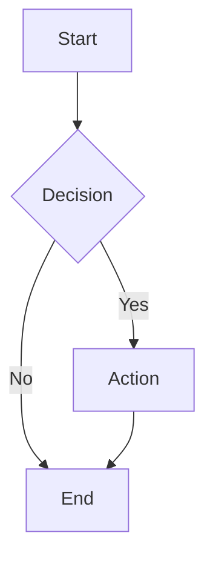
````

Follow these rules:
- **Always specify direction** for flowcharts: `TD`, `LR`, `BT`, `RL`
- **Use pipe syntax for edge labels**: `A -->|label| B` (not `A -- label --> B`)
- **Quote labels with special characters**: `A["Label with (parens)"]`
- **Use short node IDs**: `A`, `B`, `svc1` — put descriptive text in labels
- **Keep diagrams focused**: one concept per diagram; split complex systems into multiple diagrams

### 3. Save the Output

**Inline in an existing note:**
Add the mermaid code block directly into the relevant markdown file (spec, plan, analysis, etc.).

**As companion to a project artifact:**
Follow the inline attachment protocol if the diagram accompanies a project deliverable.

**Standalone:**
Save as `[topic]-diagram.md` in `_inbox/` with a brief heading above the code block explaining what the diagram shows.

### 4. Verify

After writing, confirm:
- [ ] Diagram renders correctly (mentally validate syntax — check for unclosed brackets, missing `end` keywords, duplicate IDs)
- [ ] All node IDs are unique within the diagram
- [ ] Edge labels use pipe syntax `-->|label|`
- [ ] Direction is specified for flowcharts
- [ ] No hardcoded colors that will break in dark mode (see Styling section)

## Syntax Quick Reference

### Flowchart

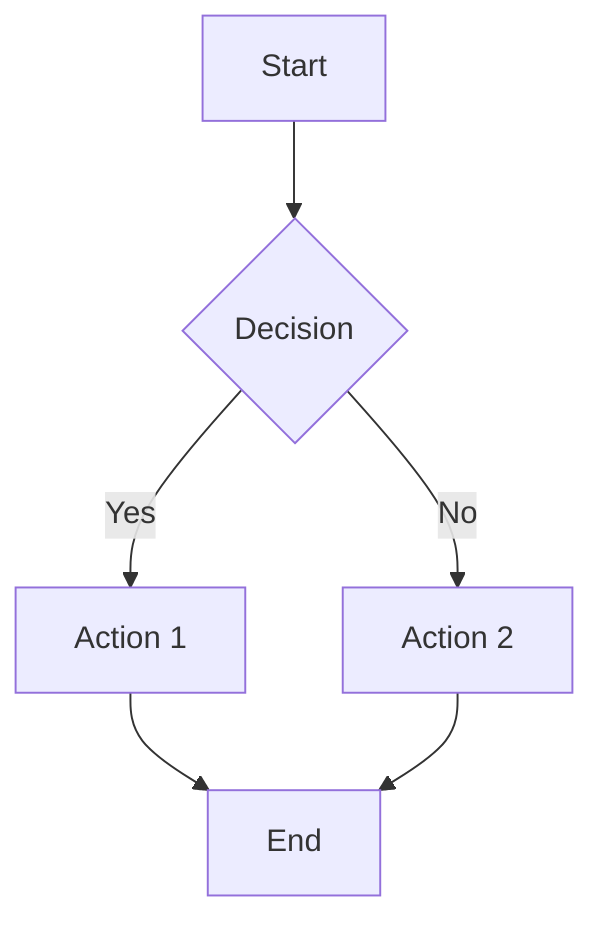

**Direction:** `TD` (top-down), `LR` (left-right), `BT` (bottom-top), `RL` (right-left)

**Node shapes:**
- `A[Text]` — rectangle
- `A(Text)` — rounded rectangle
- `A([Text])` — stadium/pill
- `A[(Text)]` — cylinder (database)
- `A((Text))` — circle
- `A{Text}` — diamond (decision)
- `A{{Text}}` — hexagon

**Edge styles:**
- `-->` — arrow
- `---` — line (no arrow)
- `-.->` — dotted arrow
- `==>` — thick arrow
- `-->|label|` — arrow with label

**Subgraphs:**
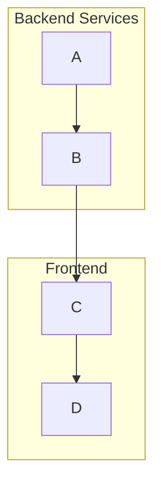

### Sequence Diagram

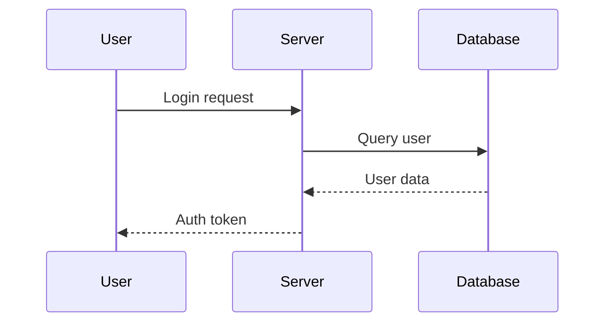

**Arrow types:**
- `->>` — solid arrow (request)
- `-->>` — dashed arrow (response)
- `-x` — solid with X (failed)
- `-)` — open arrow (async)

**Blocks:**
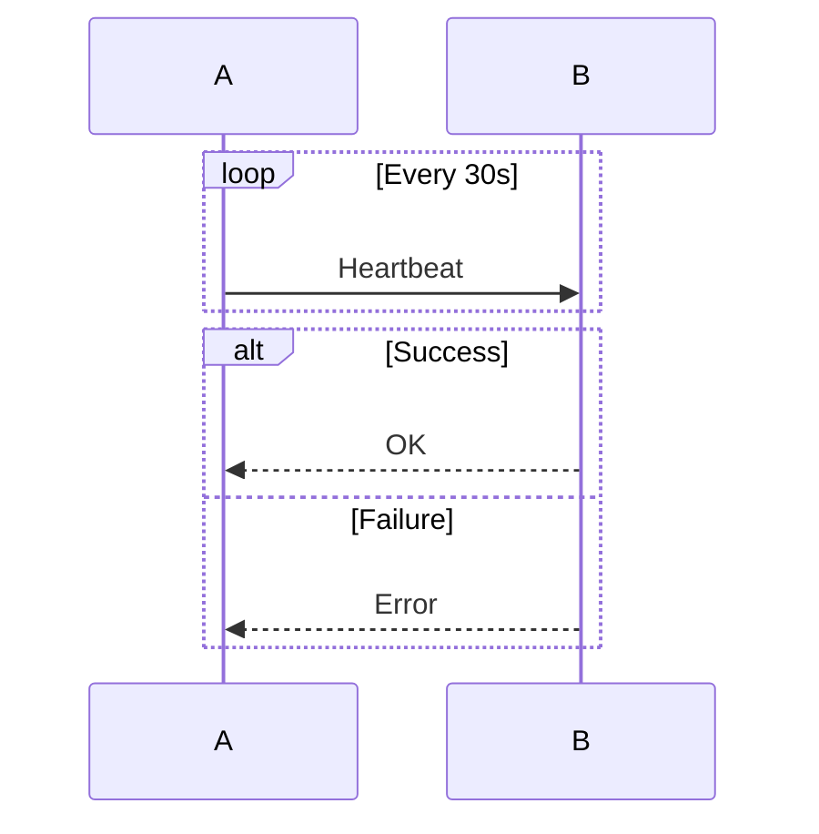

### State Diagram

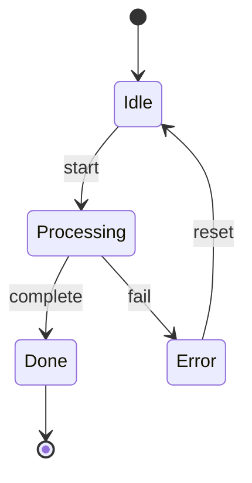

**Composite states:**
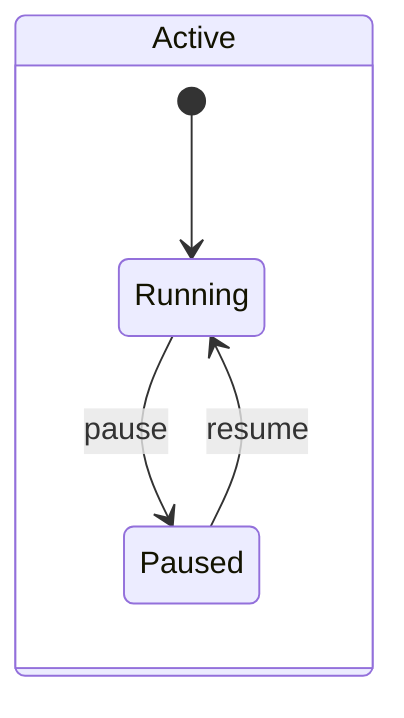

### Class Diagram

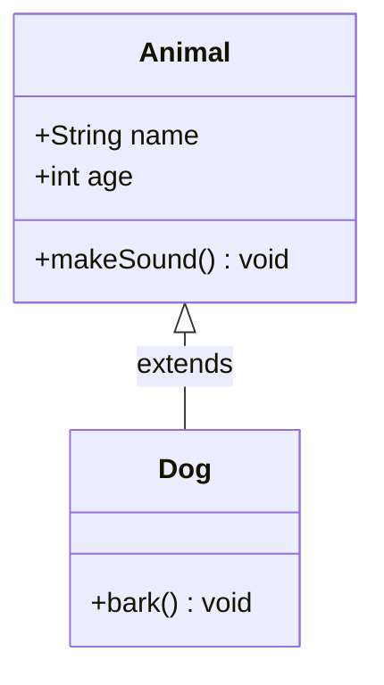

**Relationships:** `<|--` inheritance, `*--` composition, `o--` aggregation, `-->` association, `..>` dependency

### Entity-Relationship Diagram

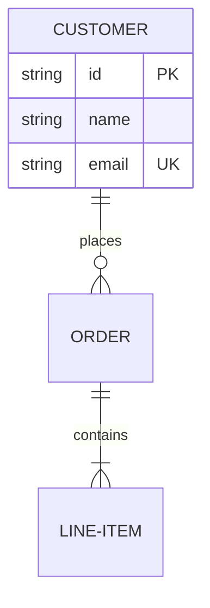

**Cardinality:** `||` exactly one, `|{` one or more, `o{` zero or more, `o|` zero or one

### Gantt Chart

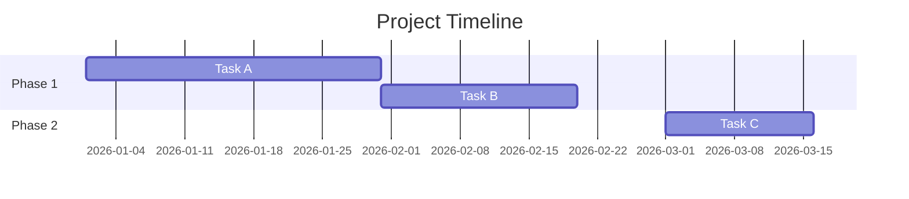

### Mind Map

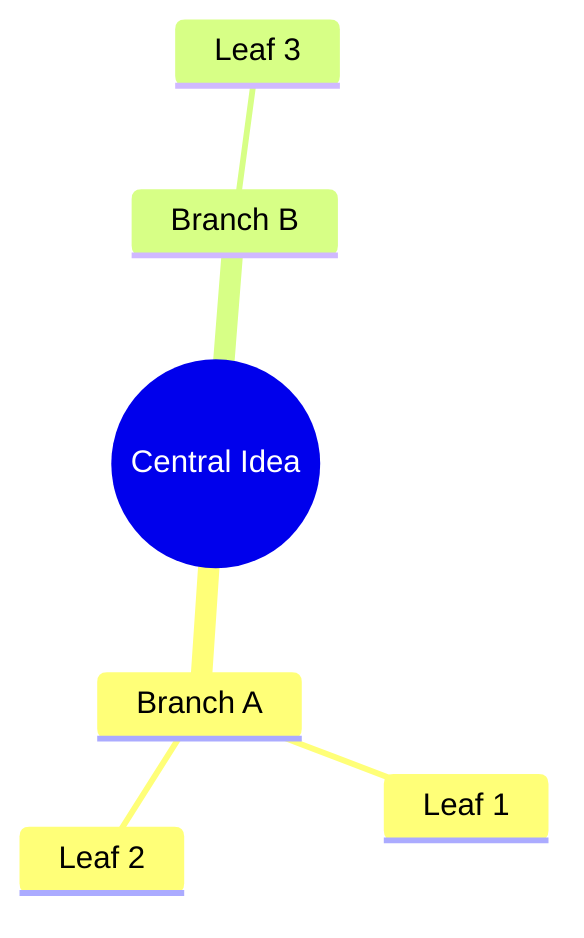

### Pie Chart

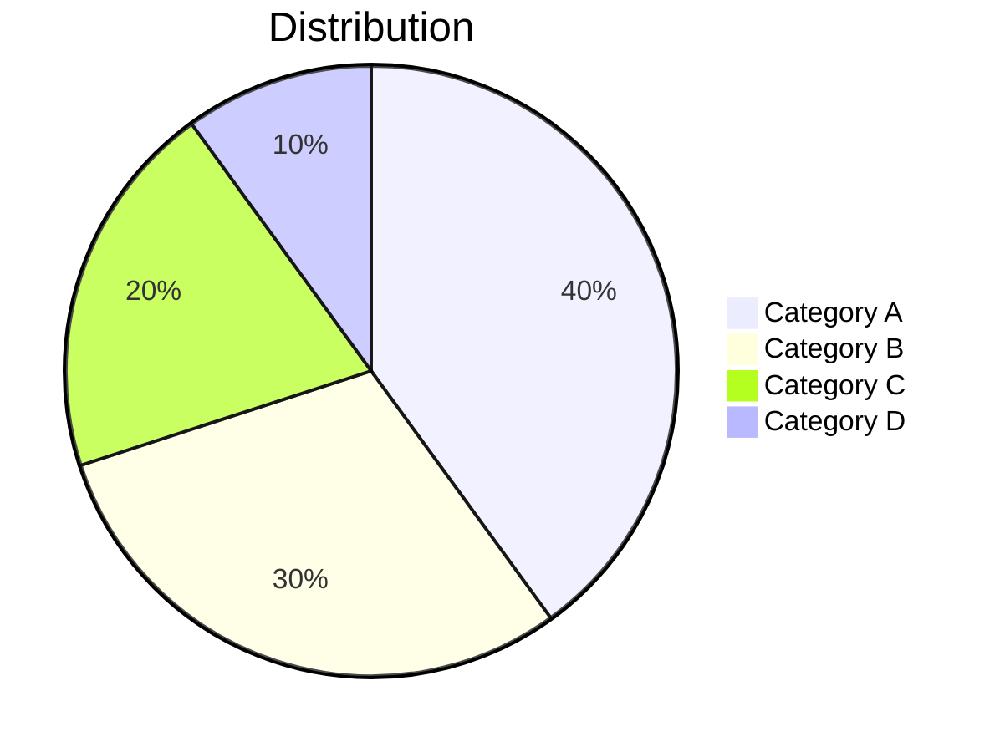

Pie charts are appropriate only when showing proportion of a whole with 2-3 segments where the viewer needs a rough sense of relative size, not precise comparison. For 4+ categories, or when the viewer needs to compare values precisely, use `xychart-beta` bar chart instead. Pie charts are the most overused and least accurate chart type.

### XY Chart (Bar/Line)

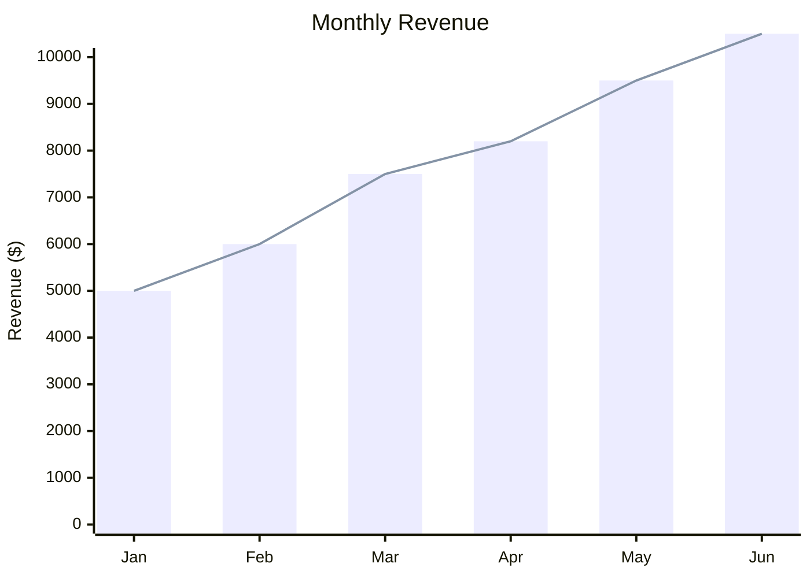

**Design notes:**
- Start y-axis at zero unless there is a clear analytical reason not to (and note the truncation)
- Prefer bar for comparison across categories; prefer line for trends over time
- If showing multiple series, use direct labeling or distinct visual treatments rather than relying on color alone
- For many categories or time periods, consider multiple small charts (multiple separate mermaid code blocks in the same note) rather than one cluttered chart

### Timeline

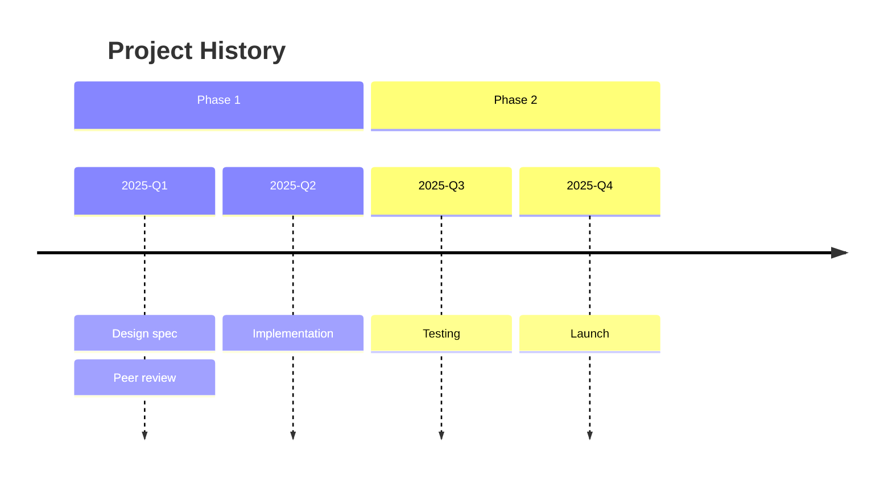

### Kanban

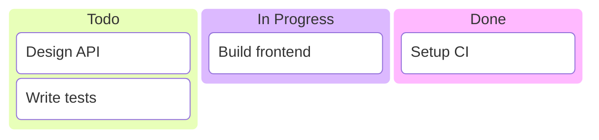

Supports metadata: `task1[Label]@{ assigned: 'name', ticket: 'PROJ-123', priority: 'High' }`

### Architecture

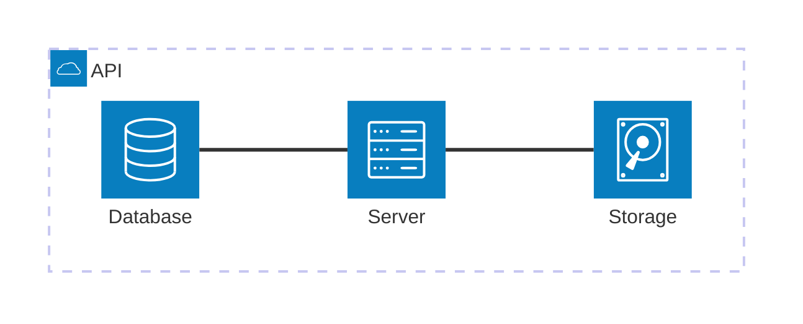

Built-in icons: `cloud`, `database`, `disk`, `internet`, `server`. Edge direction: `L`/`R`/`T`/`B`.

## Styling

### Preferred Approach: Let the Theme Do the Work

The safest and most maintainable approach to Mermaid styling is to **avoid hardcoded colors entirely** and rely on Mermaid's built-in themes. This eliminates dark mode issues and keeps diagrams visually consistent with the vault's appearance.

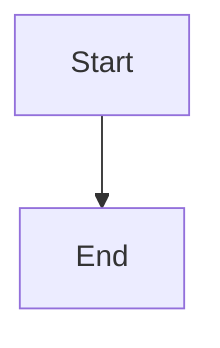

Available themes: `default`, `forest`, `dark`, `neutral`.

The mental model: a good diagram needs only **two colors** — background and foreground. Everything else (node fills, strokes, edge colors, label text) can be derived from those two. Mermaid's built-in themes do exactly this. The `default` and `neutral` themes work well in both light and dark Obsidian modes because they adapt to the surrounding CSS context.

**When you need some custom color** (e.g., to highlight a specific node or distinguish error paths), use `theme: 'base'` with minimal `themeVariables` overrides rather than per-node `classDef` or `style` directives:

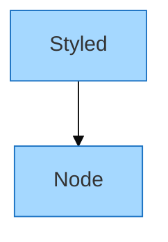

This keeps the derivation chain intact — Mermaid computes complementary colors for secondary elements, labels, and edges from your overrides.

### Per-Node Styling (Use Sparingly)

When you genuinely need per-node color control (e.g., marking one node as an error state in an otherwise theme-styled diagram), use `classDef` or inline `style`:

**CSS Classes (flowcharts):**
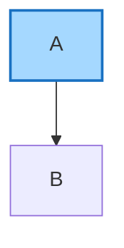

**Inline Styles:**
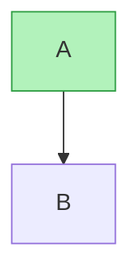

### Semantic Color Conventions

When you do hardcode colors, use these conventions for consistency across diagrams:

| Meaning | Fill | Stroke |
|---------|------|--------|
| Information / Input | `#a5d8ff` | `#1971c2` |
| Success / Output | `#b2f2bb` | `#2f9e44` |
| Warning / Decision | `#ffec99` | `#f08c00` |
| Error / Danger | `#ffc9c9` | `#e03131` |
| External / Special | `#d0bfff` | `#9c36b5` |
| Neutral | `#e9ecef` | `#868e96` |

**Rules when hardcoding colors:**
- Always pair `fill` with a visible `stroke` — light fills are nearly invisible on white backgrounds without a border.
- Never use color as the sole differentiator between elements. Always combine with a secondary signal: different node shapes, text labels, or spatial position. This matches the Excalidraw skill's accessibility rules.
- If overriding text color via `color:` in a `classDef`, use `#1e1e1e` (light mode) or `#c9d1d9` (dark mode) — never the matched stroke color (they fail WCAG AA contrast on their paired fills).

### Dark Mode Considerations

Obsidian 1.8.3+ changed how Mermaid themes interact with dark mode. Hardcoded colors in `classDef` and `style` directives may display incorrectly.

**Decision tree:**
1. **No custom colors needed?** → Use `%%{init: {'theme': 'default'}}%%` or omit the init directive entirely. Done.
2. **Need a consistent color accent?** → Use `%%{init: {'theme': 'base', 'themeVariables': {...}}}%%` with 1-2 overrides. Mermaid derives the rest.
3. **Need per-node colors that must work in both modes?** → Use the dark-safe stroke values below, or accept that the diagram is light-mode-only and note this in a comment.

**Dark-safe stroke alternatives** (for the semantic color conventions above):

| Light mode stroke | Dark mode alternative |
|---|---|
| `#1e1e1e` (black) | `#c9d1d9` |
| `#1971c2` (blue) | `#58a6ff` |
| `#e03131` (red) | `#f85149` |
| `#9c36b5` (purple) | `#bc8cff` |
| `#2f9e44` (green) | No change needed (passes AA) |
| `#f08c00` (orange) | No change needed (passes AA) |
| `#868e96` (gray) | No change needed (passes AA) |

Note: Styling support varies by diagram type. Flowcharts support `classDef` and `style`. Sequence diagrams support `rect` blocks. State and class diagrams have limited styling.

## SVG/PNG Export (Optional)

For standalone image export, use `mmdc` (Mermaid CLI) — the official rendering tool maintained by the Mermaid team:

```bash
# SVG
mmdc -i diagram.mmd -o diagram.svg -t dark -b transparent

# PNG (uses headless Chromium)
mmdc -i diagram.mmd -o diagram.png -t dark -b transparent -s 2

# From inline code
echo "graph TD; A-->B" | mmdc -i - -o diagram.svg -e svg

# Transform markdown — replace mermaid blocks with SVG references
mmdc -i notes.md -o notes-rendered.md
```

Prerequisite: `npm install -g @mermaid-js/mermaid-cli` or `brew install mermaid-cli`.

Only use this path when the user specifically needs an image file rather than inline Obsidian rendering. For most vault work, Obsidian's native mermaid rendering is sufficient.

## Obsidian Compatibility Caveats

**Bundled version:** Obsidian 1.12.2 bundles Mermaid 11.4.1. This is several versions behind the latest (11.12.3).

**Known issues:**
- Undirected graph edges (`---`) may render with arrows instead of lines (fixed in 11.5.0, not yet in Obsidian)
- Dark mode color corruption with hardcoded `classDef`/`style` colors (see Styling section)

**Beta diagram types and lazy loading:** Some diagram types in Mermaid are loaded lazily and may not be registered in Obsidian's build even though the version number supports them. ZenUML is a known example — Mermaid supports it since v10.2.3, but Obsidian doesn't register it. **Test unconfirmed beta diagram types in Obsidian before committing to them in a deliverable.** Confirmed types are listed in the diagram type table above.

## Common Mistakes to Avoid

1. **Missing direction** — always specify `TD`, `LR`, etc. for flowcharts
2. **Space-dash edge labels** — `A -- label --> B` can cause render issues; use `A -->|label| B`
3. **Unquoted special characters** — wrap in quotes: `A["Label with (parens)"]`
4. **Overcomplicated diagrams** — if a diagram has >15 nodes, consider splitting into multiple diagrams. Ask: is this trying to say too much at once?
5. **Duplicate node IDs** — each ID must be unique within a diagram
6. **Missing `end`** — every `subgraph`, `loop`, `alt`, `state` block needs `end`
7. **Using `sequenceDiagram` styling in `flowchart`** — syntax is not interchangeable
8. **Jumping to per-node colors** — prefer `%%{init: {'theme': ...}}%%` over `classDef`/`style` for most diagrams; only use per-node color when a specific node needs to stand out
9. **Relying on color alone** — never use color as the sole differentiator between elements; always combine with shape, label, or position differences

## Context Contract

**MUST have:**
- User's description of what to visualize
- Diagram type (inferred or explicit)

**MAY request:**
- Project specification or design doc (to diagram accurately)
- Existing diagrams in the same note (to maintain consistency)
- Design Advisor overlay (for complex visual deliverables — presentations, shared exports)

**AVOID:**
- Loading reference files for simple diagrams — this SKILL.md has sufficient syntax reference
- Generating SVG/PNG unless explicitly requested

**Typical budget:** Minimal tier (0–1 additional docs). This skill is self-contained for most use cases.

## Output Constraints

- Mermaid code blocks use triple-backtick fencing with `mermaid` language tag
- Diagrams embedded in markdown files use YAML frontmatter per vault conventions
- Standalone diagram files get a heading explaining the diagram's purpose
- Target ~15 nodes per diagram for readability; split larger systems across multiple diagrams rather than cramming

## Output Quality Checklist

Before marking complete, verify:
- [ ] Mermaid syntax is valid (no unclosed brackets, subgraphs, or blocks)
- [ ] All node IDs are unique within each diagram
- [ ] Direction specified for flowcharts
- [ ] Edge labels use pipe syntax `-->|label|`
- [ ] Styling uses theme-level init directive where possible; per-node colors only where justified
- [ ] Color is not the sole differentiator — shape, label, or position also distinguishes elements
- [ ] Diagram complexity is appropriate (≤15 nodes, or justified split across multiple diagrams)
- [ ] File saved to correct location (inline, project attachments, or `_inbox/`)
- [ ] Beta diagram types tested in Obsidian before delivery

## Excalidraw Mode

When the user explicitly requests freeform spatial layout, wireframes, hand-drawn aesthetic, or says "excalidraw" / "draw this" / "sketch this", generate an `.excalidraw` JSON file instead of a Mermaid code block.

**When to use Excalidraw over Mermaid:**
- Freeform spatial positioning matters (wireframes, UI mocks)
- Hand-drawn aesthetic is the goal
- Mind maps that need radial layout or visual emphasis
- Standalone visual artifact is the deliverable (not inline in a note)

**Essential rules for Excalidraw JSON:**
- Every element needs: `type`, `id`, `x`, `y`, `width`, `height`, `seed` (unique random int), `versionNonce` (unique random int)
- Use descriptive IDs: `"auth-service"`, not `"rect-1"`
- Bind text to containers: set `containerId` on text, `boundElements` on shape — always bidirectional
- Bind arrows to shapes: set `startBinding`/`endBinding` on arrow, `boundElements` on both shapes
- Arrow `points` are relative to `x`, `y`. First point is always `[0, 0]`. Never set `angle` on arrows.
- `width`/`height` must equal the bounding box of the `points` array
- Default style: `roughness: 0`, `fontFamily: 2` (Helvetica), `strokeWidth: 2`
- Use semantic colors: info `#a5d8ff`/`#1971c2`, success `#b2f2bb`/`#2f9e44`, warning `#ffec99`/`#f08c00`, error `#ffc9c9`/`#e03131`
- Text inside colored boxes uses `#1e1e1e` (not stroke color)
- ≤3 accent colors per diagram; 100px spacing between major elements

**After generating**, validate with:
```bash
python3 .claude/skills/mermaid/excalidraw-reference/validate-excalidraw.py <file.excalidraw>
```

**Reference files** (load only for complex diagrams):
- `excalidraw-reference/element-reference.md` — full property docs
- `excalidraw-reference/diagram-patterns.md` — layout patterns per type
- `excalidraw-reference/examples.md` — complete working JSON templates

## Compound Behavior

Track which diagram types are requested most frequently and which produce the best results. When reusable patterns emerge (e.g., a standard Crumb project architecture diagram, a recurring Gantt template), propose additions to `_system/docs/solutions/`. Note which Mermaid diagram types work reliably in Obsidian vs which have rendering issues — update the compatibility caveats section when new information surfaces.

## Convergence Dimensions

1. **Syntactic validity** — diagram renders without errors in Obsidian preview mode; no syntax warnings
2. **Visual clarity** — diagram communicates its subject without requiring explanation; appropriate complexity for the content; color and styling support readability
3. **Vault integration** — file saved to correct location, frontmatter conventions followed, diagram type appropriate for the medium (inline vs standalone)
