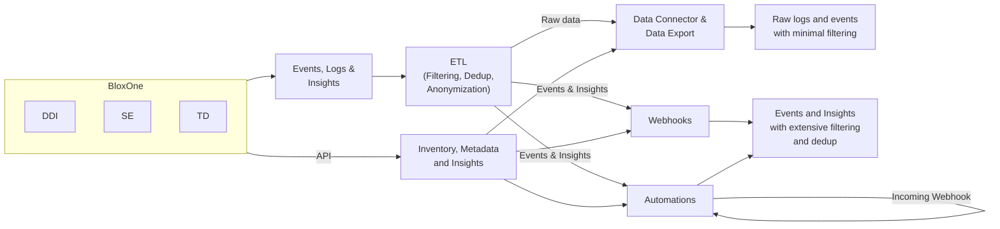

# Visual Content — SEC2 - Final Security EcoSystem Deep Dive.pptx

**Source:** SEC2 - Final Security EcoSystem Deep Dive.pptx | **Images:** 226 found, 9 processed, 178 decorative skipped
**Captured:** 2026-03-06

---

## diagram: BloxOne Ecosystem Integration Flow

**Location:** embedded image (image224.png)
**Confidence:** high
**Notes:** Original uses graduated blue arrow widths to show data volume decreasing through ETL stages. Mermaid can't represent arrow thickness. The "Incoming Webhook" on Automations is a bidirectional loop (automations receive inbound webhooks as triggers). Three BloxOne services (DDI, SE, TD) feed into a common Events/Logs/Insights pipeline, then through ETL to three output channels with decreasing data volume: Data Connector (raw), Webhooks (filtered), Automations (filtered + triggered).

---

## table: Universal DDI Token/Licensing Model

| Token Category | Component | Sizing Metric | Required? |
|---|---|---|---|
| **Management Tokens** | Universal DNS Management | Per # of DNS objects | Mandatory |
| | Universal DHCP Management | Per # of DHCP objects & IPs | Mandatory |
| | Universal IPAM | Per # of IPAM objects & IPs | Mandatory |
| | Universal Asset Insights | Per # of Asset | Mandatory |
| **Reporting Tokens** | Reporting | Per M logs per month | Optional |
| | Ecosystem | Per M log events per month | Optional |
| **Server Tokens** | NIOS-X Virtual Servers | Per Virtual Server sized by performance (QPS, LPS) and capacity (objects) | Optional |
| | NIOS-X as a Service | Per Cloud Service sized by performance (QPS, LPS) and capacity (objects) | Optional |

**Location:** embedded image (image220.png)
**Confidence:** high
**Notes:** Three token categories with mandatory/optional split. Management tokens are the base requirement. Reporting and Server tokens are add-ons. Ecosystem reporting tokens are separate from standard reporting tokens.

---

## table: BloxOne Ecosystem vs TD Feature Comparison

| Feature | BloxOne Ecosystem for B1TD | BloxOne TD Bus. Cloud/Advanced |
|---|---|---|
| Licensing | Per user, guardrails (4k events/user/day), extension for excessive usage | Per user, guardrails for QPS only, not enforced |
| Log export: Cloud to on-prem (or Cloud via on-prem), on-prem to on-prem | Yes | Yes |
| Log export: Cloud to Cloud | Yes | No |
| Automation workflows: Cloud to on-prem | Yes | No |
| Automation workflows: Cloud to cloud | Yes | No |
| Bidirectional traffic flows | Yes | No |
| Supported integrations & auto-provisioning | Yes | No |
| Outbound Notifications (NIOS) | Yes | Yes |

**Location:** embedded image (image221.png)
**Confidence:** high
**Notes:** Ecosystem license is significantly more capable. Cloud-to-Cloud export, automation workflows, and bidirectional flows are Ecosystem-only. TD Business Cloud/Advanced only gets on-prem log export and NIOS outbound notifications. Key SE differentiator: 6 of 8 capabilities are Ecosystem-exclusive.

---

## table: Security Ecosystem Subscription Comparison

| Capability | Security Ecosystem Business Subscription | BloxOne TD Business Cloud / Advanced | BloxOne Security Ecosystem (Add-on)* |
|---|---|---|---|
| License Model | Per Grid | Per User | Per User |
| NIOS Outbound Notifications | Yes | | |
| NIOS Log Export - Data Connector | Yes | | |
| BloxOne Log Export - Data Connector (CDC) | | Yes | |
| BloxOne Log Export - Cloud to Cloud (C2C) | | Required | Yes |
| BloxOne Automation Workflows | | Required | Yes |
| Support for Certified integrations | Yes | Yes | Yes |

**Location:** embedded image (image219.png)
**Confidence:** high
**Notes:** Three subscription paths. "Required" in TD column means the Ecosystem add-on is needed for that feature. Business Subscription (Per Grid) covers NIOS-based exports. BloxOne cloud features require Per User licensing. The Add-on column shows what Ecosystem unlocks on top of existing TD subscriptions.

---

## screenshot: Grafana BITS Monitoring Dashboard

Grafana dark-theme dashboard titled "BITS Monitoring" with CDI Feature Utilization sub-header. Four main panel groups:

- **Total Flows (Source to Destination):** horizontal bar chart showing flow volumes by source-destination pair (BLOXONE_TO_SPLUNK, NIOS_TO_SPLUNK, NIOS_TO_SPLUNKCLOUD, BLOXONE_TO_SPLUNKCLOUD, NIOS_TO_SYSLOG)
- **Accounts per Flow:** horizontal bar chart breaking down customer accounts per flow type
- **Total Flows Per Account:** time-series charts per flow type showing per-customer volumes over time
- **Additional time-series:** BLOXONE_TO_SPLUNKCLOUD and NIOS_TO_SYSLOG views

**Location:** embedded image (image225.png)
**Confidence:** medium (small resolution, some axis labels hard to read)
**Notes:** Internal Infoblox operations dashboard showing customer data flow volumes through the BITS (BloxOne Integration and Telemetry Service) pipeline. Shows which flow types are most heavily used. Splunk is the dominant destination. Customer names scrubbed from this description.

---

## screenshot: BloxOne Data Configurator — TD Feed Export Fields

BloxOne "Edit Data Configurator" wizard showing the **Threat Defense Threat Feeds Hits Log** export configuration. Left nav: General, Log Source Configuration, Destination Configuration, Service Instance, Summary. Export Fields panel shows "All fields selected" with visible fields: Client ID, Client Site ID, Connection Type, Destination IP, Destination Port, Device IP, DHCP Fingerprint, DNS Tags, DNS View, Domain Category, Feed Name, Feed Type.

**Location:** embedded image (image216.png)
**Confidence:** high
**Notes:** Shows the field-level granularity available in CDC exports. The "Threat Feeds Hits Log" is one of several log types available for export.

---

## screenshot: BloxOne Data Configurator — Query/Response Log Fields

BloxOne "Create New Data Configuration" wizard for the **Threat Defense Query/Response Log** ("reports DNS query requests and responses in BloxOne Threat Defense"). Export Fields: Additional Answer Count, Anonymized, Answer Count, Application, Authority Answer Count, Client ID, Connection Type, Delay, Destination IP, Destination Port, Device IP, Device MAC Address (list continues).

**Location:** embedded image (image215.png)
**Confidence:** high
**Notes:** Second log type available for CDC export. The Query/Response Log includes DNS-specific fields (Answer Count, Authority Answer Count, Application) not present in the Threat Feeds Hits Log.

---

## screenshot: HTTP Destination Configuration — Format Selector

BloxOne "Create HTTP Destination Configuration" form. Fields: Name, Description, State (toggle), Tags. The Format dropdown is open showing two native format options: **Microsoft Sentinel** and **Splunk CIM**. HTTPS Details section visible below.

**Location:** embedded image (image217.png)
**Confidence:** high
**Notes:** Shows the cloud-to-cloud (C2C) export destination configuration. Currently limited to two native format options: Microsoft Sentinel and Splunk CIM. This is the Ecosystem-only feature from the comparison tables.

---

## screenshot: Tenable Vulnerability Management Overview

Tenable "Vulnerability Management Overview (Explore)" dashboard showing:

- **Severity by Source:** Nessus: 68K (11.3K Critical, 38.3K High) | Nessus Agent: 0 | Agentless: 0
- **VPR Ratings:** 9.0-10: 5.4K | 7.0-8.9: 9K | 4.0-6.9: 42.7K | 0.0-3.9: 11K
- **SLA Progress:** Critical 5.4K (not meeting SLA), High 9K (not meeting), Medium 40.3K/2.4K, Low 6.3K/4.1K
- **Critical and High Exploitable Vulnerabilities:** bar chart (Exploited by Malware highest)
- **Future Threats (Not Yet Exploitable):** Proof of Concept and Unproven Exploit counts across 4 time windows
- **Cyber Exposure News Feed:** CVE-2024-4358 (Telerik), Azure Service Tags bypass, CVE-2024-24919 (Check Point), Microsoft May 2024 Patch Tuesday

**Location:** embedded image (image148.png)
**Confidence:** high
**Notes:** Tenable integration screenshot showing what BloxOne Ecosystem data enables in a vulnerability management context. The specific data shown (June 2024 CVEs) dates this slide content.

---

## screenshot: Microsoft Sentinel Automation Rules

Microsoft Sentinel "Automation" blade showing a table of automation rules. Visible rules include SOAR-based correlation for endpoints, hosts, and users, plus Infoblox-specific actions for NIOS and BloxOne integration with Microsoft Sentinel, Microsoft Teams, Cortex XSOAR, and ServiceNow. All rules shown as Enabled. Detail panel shows a "Modify Incident Owner in Microsoft Teams" adaptive card for incident reassignment workflow.

**Location:** embedded image (image158.png)
**Confidence:** medium (small resolution, some rule names truncated)
**Notes:** Demonstrates the Sentinel SOAR integration — Infoblox events trigger automated playbooks across multiple platforms.

---

## screenshot: Cribl Stream Dashboard

Cribl Stream web UI "Home" tab showing: **QuickConnect** panel (connect Sources to Destinations via Pipelines and Packs), **Routes** panel (connect Destinations via Routes with filtering rules). **Recent Actions:** list of updated sources, destinations, and pipelines with timestamps. **Highlights:** 11 Sources, 1 Destination, 1 Pipeline, 3 items updated, 2.00 GB processed in, 2.23 GB out.

**Location:** embedded image (image171.png)
**Confidence:** high
**Notes:** Shows Cribl Stream as a data routing intermediary in the ecosystem. The QuickConnect/Routes model maps to the ETL layer in the BloxOne Ecosystem Integration Flow diagram.
