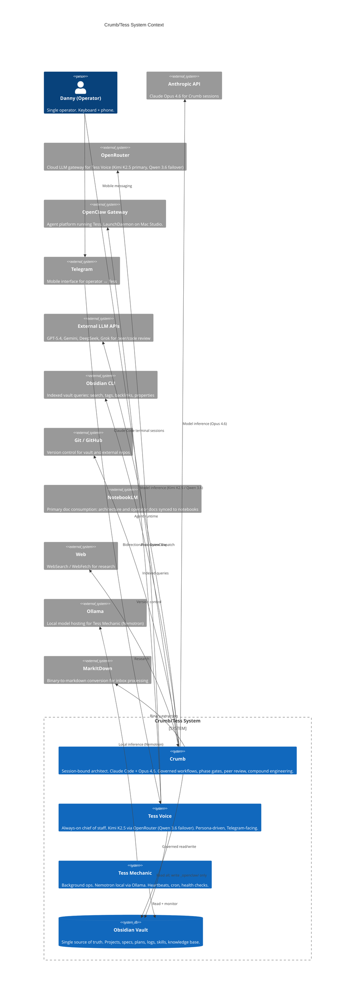

# 01 — Context and Scope

This section defines the system boundary, actors, external interfaces, and constraints of the Crumb/Tess system. It answers: what is this system, who uses it, what does it touch, and what limits apply?

**Source attribution:** Synthesized from the design spec ([[crumb-design-spec-v2-4]] §0–§2, §7, §9), [[CLAUDE.md]], the existing architecture diagram (formerly `system-architecture-diagram.md`), actor definitions (formerly in `tess-crumb-comparison.md`), and the boundary reference (formerly `tess-crumb-boundary-reference.md`). The three formerly-named sources were retired 2026-07-03 (vault-optimization B3); full text in git history.

> **Historical (decommissioned):** The three-agent context described in this section (Crumb + Tess Voice + Tess Mechanic via the OpenClaw gateway) was decommissioned by project agentic-sunset (2026-06-01 → 2026-06-12), reboot-verified absent 2026-06-14. `_openclaw/` is deleted from disk. **Current reality:** Crumb (Claude Code sessions) is the only agent; danny is the sole operator, running Crumb directly at the keyboard. The Telegram/Tess interaction channel, the bridge handoff, and the OpenClaw-gateway external system no longer exist. The full three-agent model is preserved below as historical record — see the "Current State" summary immediately below, and [[03-runtime-views]] / [[04-deployment]] for the fullest decommission framing.

## Current State (2026-07-05)

Single operator (danny), single agent (Crumb, Claude Code sessions, Claude Opus). No Telegram channel, no always-on background agent, no bridge. The vault remains the single source of truth and the only communication/persistence layer. Crumb reads and writes it under full governance; danny interacts only at the keyboard (interactive sessions or scheduled/cron-invoked `claude --print` for narrow automation, e.g. session-end scripts) — there is no mobile/asynchronous agent surface today. Everything from "## System Purpose" through "## Handoff Model" below describes the historical three-agent design and is kept for architecture history.

---

## System Purpose

Crumb/Tess is a **personal multi-agent operating system** for a single operator. It manages work across all life domains — software, career, learning, health, financial, relationships, creative, spiritual, lifestyle — through AI agents orchestrated around an Obsidian vault as the single source of truth.

The system exists to:

- **Persist context across sessions.** AI chat history is ephemeral; the vault is not. Every decision, artifact, and insight survives beyond any single conversation.
- **Enforce governed workflows.** Spec-first, design-first, plan-first — with phase gates, convergence checks, peer review, and compound engineering at every transition.
- **Compound over time.** Each unit of work should make future work easier. Patterns become solution docs, conventions become vault-check rules, recurring tasks become skills.
- **Cover the full operating day.** *(Historical — decommissioned 2026-06):* Session-bound deep work (Crumb) and always-on operations (Tess) together spanned keyboard sessions and mobile availability. Currently the system covers only session-bound keyboard work; the always-on/mobile leg has no active replacement.

---

## Historical: Context Diagram (three-agent model, pre-decommission)

> **Historical (decommissioned):** Describes the Crumb + Tess Voice + Tess Mechanic / OpenClaw model, decommissioned by agentic-sunset (2026-06-01 → 2026-06-12), reboot-verified absent 2026-06-14. Kept as architecture history — see "Current State" above for what's actually running.

### Prose Summary (for environments that cannot render Mermaid)

The system has one human operator (Danny) who interacts through two channels: a Mac Studio terminal running Claude Code (for Crumb sessions) and Telegram on phone (for Tess interactions).

Inside the system boundary, three agents share a single Obsidian vault:

- **Crumb** reads and writes to the vault under full governance. It connects to the Anthropic API for model inference, dispatches to external LLM APIs for peer review, uses the Obsidian CLI for indexed queries, manages Git version control, and performs web research.
- **Tess Voice** reads the entire vault but writes only to `_openclaw/` directories. It runs via the OpenClaw gateway against OpenRouter (Kimi K2.5 primary, Qwen 3.6 failover), connected to Telegram.
- **Tess Mechanic** reads and monitors the vault. It runs locally on Ollama (Nemotron) for structured ops work.

The vault is the central bus — all inter-agent communication flows through the filesystem. There is no RPC, no sockets, no direct invocation between agents.

External to the system: NotebookLM consumes exported architecture and operator docs. MarkItDown converts binary files to markdown during inbox processing. Git/GitHub provides version control for both the vault and external project repositories.

---

## Historical: Actor Model (three-agent, pre-decommission)

> **Historical (decommissioned):** Tess Voice and Tess Mechanic were decommissioned by agentic-sunset (2026-06-01 → 2026-06-12), reboot-verified absent 2026-06-14. Danny and Crumb remain current; the two Tess actor sections below are kept as architecture history.

### Danny (Operator)

The single human user. All system authority derives from Danny. Crumb and Tess are agents acting on Danny's behalf — neither has independent agency.

**Interaction modes:**
- **At keyboard** — Mac Studio terminal, Claude Code sessions. Full tool access, direct vault manipulation, governed workflow participation. This is Crumb's activation context.
- **On phone** — *(Historical — decommissioned 2026-06):* Telegram via Tess. Quick lookups, status checks, approvals, inbox triage. Asynchronous, lightweight. No direct vault editing. No mobile/asynchronous channel currently exists.

**Governance role:** Risk-tiered approval gates. Low-risk actions auto-approve. Medium-risk actions proceed with a flag. High-risk actions (architecture changes, external comms, irreversible operations) require explicit approval before execution.

### Crumb (System Architect)

Session-bound. Runs only when Danny starts a Claude Code session. Claude Opus 4.6, always.

**What Crumb owns:**
- Architecture and design decisions (sole authority)
- Governed project workflows (SPECIFY → PLAN → TASK → IMPLEMENT for software; shorter variants for other domains)
- Phase gate execution, convergence checks, compound engineering
- Skill, subagent, overlay, and primitive creation
- Vault structure and schema governance
- Session logging (run-log, session-log)
- Peer review and code review dispatch

**What Crumb does not do:**
- Persist between sessions (no daemon, no background process)
- Monitor anything between sessions
- Handle real-time communication
- Run operational automation

**Identity model:** Operational — defined by CLAUDE.md governance rules, not a character persona. Crumb is what he does: methodical, phase-gated, deliberate. Rigor over personality.

**Spawns:** Subagents (code-review-dispatch, peer-review-dispatch, test-runner) for isolated context work. External LLM panels for peer review.

### Tess Voice (Chief of Staff) — historical, decommissioned 2026-06

Always-on. Runs via OpenClaw gateway connected to Telegram. Kimi K2.5 primary with Qwen 3.6 failover, both accessed via OpenRouter (cloud).

**What Tess Voice owns:**
- Telegram relay — bidirectional communication with Danny
- Inbox triage and classification
- Quick lookups and status checks against vault state
- Bridge relay — forwarding governed requests to Crumb via `_openclaw/inbox/`
- Confirmation echo — showing exact payload and hash before write operations

**What Tess Voice does not do:**
- Make architecture or design decisions
- Modify governed project files directly
- Execute convergence protocols or compound engineering
- Create skills, overlays, or other system primitives

**Identity model:** Character-driven — `IDENTITY.md` + `SOUL.md` persona files (Tess runtime artifacts, decommissioned with the OpenClaw layer — git history). Direct, declarative, dry humor. Short sentences. Two steps ahead. Pushback is pattern-driven ("this broke last time you tried it"). A second register reaches for precedent and earned wisdom when reframing is needed.

**Vault access:** Reads the full vault. Writes only to `_openclaw/` directories (inbox, outbox, scratch, transcripts).

### Tess Mechanic (Background Ops) — historical, decommissioned 2026-06

Always-on. Runs via OpenClaw. Nemotron on local Ollama (`com.tess.llama-server` LaunchAgent).

**What Tess Mechanic owns:**
- Heartbeat checks (system health, service liveness, bootstrap domain availability)
- Scheduled cron jobs (awareness checks, health monitoring)
- Background automation that doesn't need cloud inference

**What Tess Mechanic does not do:**
- Interact with Danny directly (no Telegram presence)
- Make decisions requiring judgment beyond structured checks
- Write to the vault beyond health status files

**Identity model:** No persona. Mechanical, structured, predictable. The system's background heartbeat.

**Separation from Voice:** Distinct model, distinct cache, distinct session isolation. Voice is cloud + persona. Mechanic is local + structured. They share the OpenClaw runtime but operate independently.

---

## System Boundary

### Inside the boundary

| Component | Description |
|-----------|-------------|
| **Obsidian vault** | All state, all communication, all persistence. Projects, specs, plans, logs, skills, protocols, knowledge base. ~2800 files, ~45MB. |
| **CLAUDE.md** | Crumb's governance surface — routing rules, protocols, behavioral boundaries, risk tiers. Loaded every session. |
| **Skills** (`.claude/skills/`) | Procedural expertise packages. 15 skills covering analysis, review, diagrams, research, inbox processing, etc. |
| **Subagents** (`.claude/agents/`) | Isolated workers for code review dispatch, peer review dispatch, test running. |
| **Overlays** (`_system/docs/overlays/`) | Expert lenses (Business Advisor, Career Coach, Life Coach, etc.) injected into active skills. 8 active overlays. |
| **Protocols** | Cross-cutting workflow patterns: context checkpoint, session-end, hallucination detection, inline attachment (4 files total). |
| **Scripts** (`_system/scripts/`) | Mechanical enforcement and automation: vault-check.sh, session-startup.sh, knowledge-retrieve.sh. |
| **Bridge** (`_openclaw/inbox/` ↔ `_openclaw/outbox/`) | *(Historical — decommissioned 2026-06):* Filesystem-based handoff between Tess and Crumb. Tess wrote requests; a file watcher triggered bridge dispatch; Crumb responded under full governance. `_openclaw/` is deleted from disk; `_inbox/` is the current universal manual-drop intake (unrelated to this defunct bridge). |

### Outside the boundary

| External System | Integration | Notes |
|----------------|-------------|-------|
| **Anthropic API** | Model inference for Crumb (Opus 4.6) | Crumb-only dependency. Crumb sessions non-functional without it. |
| **OpenRouter** | *(Historical — decommissioned 2026-06)* Cloud LLM gateway for Tess Voice | Kimi K2.5 primary, Qwen 3.6 failover. Replaced direct Anthropic access for Tess Voice (migrated 2026-03-30 cloud eval). No longer in use — Tess Voice decommissioned. |
| **OpenClaw** | *(Historical — decommissioned 2026-06)* Agent gateway platform | Ran Tess. LaunchDaemon on Mac Studio. Managed Telegram bindings, cron scheduling, plugin routing. Decommissioned by agentic-sunset, reboot-verified absent 2026-06-14. |
| **Telegram** | *(Historical — decommissioned 2026-06)* Mobile messaging | Danny ↔ Tess Voice communication channel. No mobile channel currently exists. |
| **Ollama** | *(Historical — decommissioned 2026-06)* Local model hosting | Ran Nemotron for Tess Mechanic. Managed by `com.tess.llama-server` LaunchAgent. |
| **External LLM APIs** | Peer/code review panels | GPT-5.4 (OpenAI), Gemini 3.1 Pro Preview (Google), DeepSeek Reasoner, Grok 4.1 Fast (xAI). Used for cross-model validation. |
| **Obsidian** | Note-taking app | Provides the CLI for indexed queries. Vault functions without it (native file tools as fallback), but loses speed and discovery capabilities. |
| **Git / GitHub** | Version control | Vault is git-tracked. Software projects use external repos. |
| **NotebookLM** (Google) | Documentation consumption | Danny's primary interface for reading architecture and operator docs. Docs synced to Google Drive → notebook ingestion. |
| **MarkItDown** (Microsoft) | Binary extraction | CLI tool converting PDF, DOCX, PPTX, XLSX to markdown for inbox processing. |
| **Web** | Research | Claude Code's built-in WebSearch/WebFetch for the researcher skill and ad-hoc lookups. |

---

## Handoff Model

> **Historical (decommissioned):** This entire section describes the Tess ↔ Crumb bridge, decommissioned by agentic-sunset (2026-06-01 → 2026-06-12), reboot-verified absent 2026-06-14. `_openclaw/` is deleted from disk — there is no handoff model today because there is no second agent to hand off to or from. Kept as architecture history.

Inter-agent communication is mediated entirely by the vault filesystem. No agent invokes another directly.

### Tess → Crumb

Tess writes to `_openclaw/inbox/` (defunct — directory deleted 2026-06; `_inbox/` is the current, unrelated universal manual-drop intake). During a Crumb session, the bridge processor picks up requests. The filesystem is the security boundary.

**Handoff triggers:**
- Task requires architecture or design decisions
- Governed project files need modification
- Convergence, peer review, or compound engineering required
- Complexity exceeds Tess's operational scope
- Risk tier is HIGH

**Clean handoff:** Tess stages context, states the blocking question, flags "this needs a Crumb session."

### Crumb → Tess

Crumb writes project state to the vault. Tess reads it on next interaction.

**Handoff triggers:**
- Status update needs Telegram relay
- Routine monitoring or follow-up between sessions
- Task is purely operational (no governance required)

### Bridge Protocol (historical — decommissioned 2026-06)

- **Transport:** `_openclaw/inbox/` (Tess → Crumb), `_openclaw/outbox/` (Crumb → Tess) — directories deleted with `_openclaw/`
- **Detection:** kqueue file watcher (sub-ms)
- **Governance:** Bridge-invoked Crumb sessions load identical CLAUDE.md governance
- **Security:** Schema validation, payload hashing, confirmation echo, post-processing governance verification
- **Scratch space:** `_openclaw/tess_scratch/` for ephemeral bidirectional file exchange outside the bridge protocol

---

## Constraints

### Architectural

- **Vault is the bus.** All state, all communication, all persistence flows through the Obsidian vault. No agent holds authoritative state in memory.
- **OS user separation.** `danny` (operator's macOS account) owns the vault and runs Crumb. *(Historical — decommissioned 2026-06):* `tess` was the operator account name pre-migration; `openclaw` (dedicated service account) ran Tess, reading the full vault via group permissions and writing only to `_openclaw/`. Tess→danny account migration is complete; the `openclaw` service account's runtime role is gone with the decommission.
- **Single-writer assumption.** The current execution model is serial — one Crumb session at a time. *(Historical: previously also "one bridge dispatch at a time"; no bridge exists today.)* Concurrent file write safety is deferred (spec §9).
- **Session-bound vs always-on.** Crumb activates only during operator terminal sessions. *(Historical — decommissioned 2026-06):* Tess used to cover the gap between sessions; no always-on agent covers it today. This was a design choice, not a limitation — governed work requires focused context and human oversight.

### Operational

- **Spec-first discipline.** No implementation without a validated specification for substantial work. Specs are the source of truth — change specs first, regenerate downstream.
- **Risk-tiered approval.** Low → auto-approve. Medium → proceed + flag. High → stop and ask.
- **Context budget.** ≤5 source docs per skill invocation (standard); 6-8 with justification; 10 design ceiling. Context pressure degrades quality before hitting hard limits.
- **Ceremony Budget Principle.** Before proposing new capabilities, evaluate whether existing friction can be reduced first. New primitives increase operational surface.

### Technical

- **Claude Opus 4.6 for Crumb.** Non-negotiable. Model routing (`model_tier` → Sonnet delegation) applies to subagents and Sonnet-tier skills only. *(Historical: previously also applied to Tess Voice/Mechanic — decommissioned 2026-06.)*
- **macOS host.** Mac Studio, macOS 15+. TCC grants, bootstrap domains, and launchd behaviors are platform-specific constraints. Danny must be logged in (GUI or background) for Apple integrations.
- **Token limits.** Opus 4.6 has a 1M context window. Practical working range is lower — context management is autonomous per the Context Checkpoint Protocol.
- **NotebookLM consumption.** Architecture and operator docs must be self-contained enough for notebook ingestion. Clear section boundaries, explicit cross-references, no reliance on Obsidian-specific rendering.

### Security

- **No autonomous external communications.** Crumb does not send emails, post to Slack, or create GitHub issues without explicit operator approval.
- **Credential isolation.** Crumb's API keys live in the `danny` user's keychain/environment. *(Historical — decommissioned 2026-06):* Tess's credentials were in the separate `openclaw` user's environment, isolated from Crumb's. No cross-user credential access existed by design.
- **Bridge security.** *(Historical — decommissioned 2026-06, no bridge exists today.)* Four-layer defense: schema validation, payload hashing with canonical JSON, confirmation echo for write operations, post-processing governance verification.
- **Review safety.** Peer review and code review dispatch use a shared denylist (`review-safety-denylist.md`) to prevent sensitive content from reaching external LLM APIs.

---

## Design Decisions Relevant to Scope

| Decision | Rationale |
|----------|-----------|
| Two agents, not one *(historical — the Tess side was decommissioned 2026-06; Crumb is now the only agent)* | Governed deep work (Crumb) needs focused sessions with human oversight. Always-on operations (Tess) needed persistent availability. Combining them would have compromised both. |
| Vault as bus, not RPC | Filesystem exchange is debuggable (ls, cat, git diff), auditable, and survives agent restarts. No socket management, no protocol versioning, no connection state. |
| Arc42 for architecture docs | Cherry-picked sections (context, building blocks, runtime, deployment, cross-cutting) provide sufficient structure without full ceremony. |
| Diátaxis for operator docs | Four-quadrant model (tutorials, how-to, reference, explanation) prevents the common failure of mixing instructional and reference content. |
| No ADRs yet | Architecture docs capture current state. ADRs can layer on incrementally when decision archaeology becomes valuable. |
