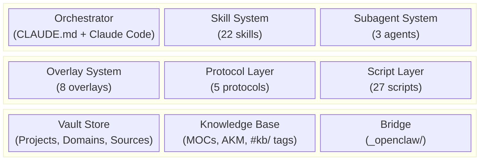
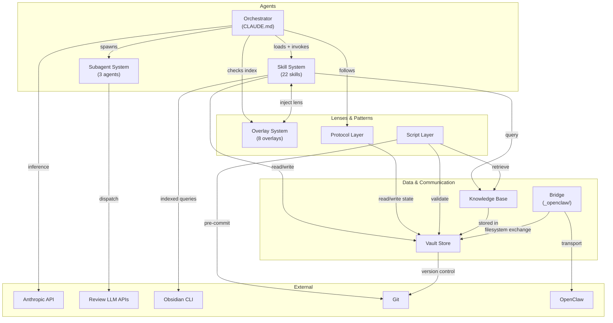

# 02 — Building Blocks

This section decomposes the Crumb/Tess system into its constituent subsystems, maps ownership and write authority, and documents the dependency relationships between blocks.

**Source attribution:** Synthesized from the design spec ([[crumb-design-spec-v2-4]] §1–§3, §5), ownership routing from [[tess-crumb-boundary-reference]], function tables from [[tess-crumb-comparison]], and live directory scans of the vault.

---

## L1 Decomposition

The system is built from nine top-level building blocks. Each block has a single primary owner (the agent responsible for its creation and maintenance) and well-defined vault locations.

### Prose Summary (for environments that cannot render Mermaid)

Nine building blocks in three tiers. **Agents tier:** the Orchestrator (CLAUDE.md governance + Claude Code runtime), Skill System (22 procedural packages), and Subagent System (3 isolated workers). **Lenses & Patterns tier:** Overlay System (8 expert lenses), Protocol Layer (5 cross-cutting workflow patterns), and Script Layer (27 mechanical enforcement and automation scripts). **Data & Communication tier:** Vault Store (the shared filesystem — Projects, Domains, Sources, system docs), Knowledge Base (MOCs, AKM/QMD retrieval, tag taxonomy), and Bridge (Tess-Crumb communication via `_openclaw/`).

---

## L2 Decomposition

### 1. Orchestrator

The Claude Code main session governed by CLAUDE.md. Not a separate entity — Claude Code IS the orchestrator.

| Component | Location | Purpose |
|-----------|----------|---------|
| CLAUDE.md | `/CLAUDE.md` | Governance surface: routing rules, protocols, behavioral boundaries, risk tiers. ~350 lines. Loaded every session. |
| AGENTS.md | `/AGENTS.md` | Tool-agnostic context. Works with any AI, not just Claude Code. |
| Routing rules | Inline in CLAUDE.md | Domain classification, workflow depth selection, prompt triage (FULL/ITERATION/MINIMAL) |
| Risk-tiered approval | Inline in CLAUDE.md | Low → auto-approve, Medium → proceed + flag, High → stop and ask |

**Key insight:** The orchestrator's intelligence comes from Claude's built-in judgment plus CLAUDE.md's routing rules. There is no separate "orchestrator agent" or "delegate mode."

### 2. Skill System

Procedural expertise packages loaded on-demand based on description match.

| Skill | Phase | Purpose |
|-------|-------|---------|
| systems-analyst | SPECIFY | Problem analysis → specification |
| action-architect | TASK/PLAN | Spec → milestones, tasks, dependencies |
| writing-coach | Any output | Clarity, structure, tone improvement |
| audit | Maintenance | Staleness scans, full audits, health checks |
| obsidian-cli | Cross-cutting | Vault query routing via Obsidian CLI |
| checkpoint | Session mgmt | State saving, context management |
| sync | Session mgmt | Git commit, backup operations |
| peer-review | Review | Cross-LLM artifact validation (4-model panel) |
| code-review | Review | Two-tier: Sonnet inline (T1) + cloud panel (T2) |
| inbox-processor | Intake | Process `_inbox/` files — classify, route |
| feed-pipeline | Intake | 3-tier feed intel routing → signal-notes |
| researcher | Research | 6-stage evidence pipeline with citation integrity |
| mermaid | Diagrams | Default diagramming in markdown |
| excalidraw | Diagrams | Freeform `.excalidraw` JSON diagrams |
| lucidchart | Diagrams | External sharing via REST API |
| deck-intel | Extraction | Structured intel from PPTX/PDF |
| diagram-capture | Extraction | Visual content interpretation from images |
| meme-creator | Creative | Meme images from quotes |
| startup | Session mgmt | Session startup hook procedures |
| vault-query | Cross-cutting | Structured vault queries for dispatch consumers |
| attention-manager | Planning | Daily attention plans, monthly reviews |
| learning-plan | Planning | Structured training plan design |

**Location:** `.claude/skills/[name]/SKILL.md` — each skill is a single markdown file with YAML frontmatter (identity, procedure, context contract, quality checklist, compound behavior, convergence dimensions). Some skills have reference subdirectories (researcher has `stages/` and `schemas/`).

**Loading:** Claude Code auto-matches skill descriptions to user requests. Skills with `model_tier: execution` delegate to Sonnet subagents. Skills without `model_tier` run on the session model (Opus).

### 3. Subagent System

Isolated context workers for tasks that benefit from separation from the main session.

| Agent | Purpose | Consumers |
|-------|---------|-----------|
| code-review-dispatch | Tier 2 cloud panel dispatch (Opus, GPT-5.4, Devstral) | code-review skill |
| peer-review-dispatch | 4-model prose review panel dispatch | peer-review skill |
| test-runner | Test suite execution in external repos | code-review skill |

**Location:** `.claude/agents/[name].md`

**Spawning:** Main session spawns subagents via the Agent tool. Each subagent gets its own context window. Returns a summary to the main session. One revision pass allowed before escalating to human gate (Subagent Revision Protocol, spec §3.2.4).

### 4. Overlay System

Expert lenses that inject domain expertise into active skills. No procedures of their own.

| Overlay | Domain | Primary Signals |
|---------|--------|-----------------|
| Business Advisor | Cross-cutting | Cost/benefit, market positioning, pricing, competitive dynamics |
| Career Coach | Career | Skill gaps, trajectory planning, stakeholder strategy |
| Life Coach | Personal | Values clarification, life direction, habit change |
| Financial Advisor | Financial | Budgeting, investment, tax, financial planning |
| Design Advisor | Creative | Visual design, dataviz, information architecture |
| Web Design Preference | Software | UI aesthetic preferences, CSS patterns |
| Network Skills | Career | DNS, DHCP/IPAM, SASE/SSE, zero trust |
| Glean Prompt Engineer | Software | Glean search app prompt engineering |

**Location:** `_system/docs/overlays/[name].md` — each under 65 lines. Routed via `overlay-index.md` (loaded at session start).

**Companion documents:** Some overlays have standing reference docs that auto-load alongside them (Design Advisor dataviz companion, Life Coach personal philosophy, Network Skills vendor catalog).

### 5. Protocol Layer

Cross-cutting workflow patterns invoked by skills or the orchestrator. Not standalone entities.

| Protocol | Location | Purpose |
|----------|----------|---------|
| Context Checkpoint | `_system/docs/context-checkpoint-protocol.md` | Phase transition procedure: compound eval → context check → log → state update |
| Session-End | `_system/docs/protocols/session-end-protocol.md` | Autonomous session close: log → failure-log → code review sweep → commit → push |
| Bridge Dispatch | `_system/docs/protocols/bridge-dispatch-protocol.md` | Tess bridge request processing under CLAUDE.md governance |
| Hallucination Detection | `_system/docs/protocols/hallucination-detection-protocol.md` | Tiered detection: always-on, risk-proportional, audit-time, monthly |
| Inline Attachment | `_system/docs/protocols/inline-attachment-protocol.md` | Binary artifact handling during project sessions |
| Dispatch Triage | `_system/docs/protocols/dispatch-triage-protocol.md` | Bridge dispatch request classification and routing |

**Additional protocols defined inline in CLAUDE.md:** Compound Step Protocol (spec §4.4), Convergence Protocol (spec §4.2), Risk-Tiered Approval Gates (spec §4.3), Project Archive/Reactivate (spec §4.6).

### 6. Vault Store

The shared filesystem. All state, all communication, all persistence.

| Directory | Purpose | Owner |
|-----------|---------|-------|
| `Projects/` | Active project scaffolds (state, specs, plans, tasks, logs, design, reviews, research, attachments) | Crumb |
| `Archived/Projects/` | Archived projects (full scaffold preserved) | Crumb (archive/reactivate) |
| `Domains/` | Domain overview notes and MOC files organized by life domain (Career, Health, Learning, etc.) | Crumb |
| `Sources/` | Knowledge notes from external sources — books, articles, podcasts, videos, courses, papers. Plus `signals/` for feed-pipeline output | Crumb |
| `_system/docs/` | System infrastructure: design spec, protocols, overlays, solutions, templates, personal context | Crumb |
| `_system/logs/` | Operational logs: session-log, AKM feedback, backup/health status, service metrics | Crumb (session-log); Scripts (metrics) |
| `_system/scripts/` | Mechanical enforcement and automation scripts | Crumb |
| `_system/reviews/` | System-level peer and code review notes + raw JSON responses | Crumb (via peer-review/code-review skills) |
| `_inbox/` | Drop zone for manually added files — processed by inbox-processor | Danny (drops); Crumb (processes) |
| `_attachments/` | Permanent storage for unaffiliated binary files after processing | Crumb (via inbox-processor) |
| `_openclaw/` | Bridge transport, Tess workspace, feed intel (see Bridge block below) | Tess |
| `.claude/` | Skills and agents (Claude Code convention) | Crumb |

### 7. Knowledge Base Layer

The semantic layer built on top of the Vault Store. Provides discovery, retrieval, and cross-referencing.

| Component | Location | Purpose |
|-----------|----------|---------|
| `#kb/` tag taxonomy | Tags on vault files | 18 canonical Level 2 tags. Level 3 subtags are open. Marks durable knowledge. |
| MOC system | `Domains/*/moc-*.md` | Maps of Content — navigational indexes per knowledge domain. 15 built MOCs. |
| AKM (Active Knowledge Memory) | `_system/scripts/knowledge-retrieve.sh` | QMD-backed semantic retrieval. Knowledge Brief at session start (5 items). Skill-activation retrieval (3 items). Decay-based relevance scoring. |
| Source indexes | `Sources/*/[source-id]-index.md` | Per-source landing pages aggregating child knowledge notes |
| `kb-to-topic.yaml` | `_system/docs/kb-to-topic.yaml` | Canonical `#kb/` tag → MOC slug mapping. Single source of truth for automated routing. |
| `topics` field | Frontmatter on `#kb/`-tagged notes | Links notes to MOCs. Enforced by vault-check. |

**Retrieval path:** AKM script → QMD semantic search → Knowledge Brief → session context. Three trigger modes: session-start (cross-domain), skill-activation (project-scoped), new-content (cross-pollination).

### 8. Script Layer

Mechanical enforcement and automation. Bash and Python scripts that run outside Claude Code's context.

| Script | Trigger | Purpose |
|--------|---------|---------|
| `vault-check.sh` | Pre-commit hook; audit skill | 30 structural validation checks. The system's only external enforcement. |
| `session-startup.sh` | SessionStart hook | Git pull, vault-check, CLI probe, rotation checks, feed-intel inbox scan |
| `knowledge-retrieve.sh` | Session start; skill activation | AKM retrieval engine — QMD search + Knowledge Brief |
| `skill-preflight.sh` | PreToolUse hook | KB-eligible skill activation → knowledge injection |
| `bridge-watcher.py` | LaunchAgent (persistent) | kqueue file watcher for `_openclaw/inbox/` — triggers bridge dispatch |
| `feed-inbox-ttl.sh` | Cron | Feed inbox TTL cleanup for aged items |
| `mirror-sync.sh` | Cron | Vault mirror sync to secondary location |
| `vault-backup.sh` | Cron | Cloud backup trigger |
| `service-status.sh` | Cron/manual | Service liveness checks |
| `system-stats.sh` | Cron | System resource metrics |
| `setup-crumb.sh` | Manual (new machine) | Full environment setup |

Plus: `batch-moc-placement.py`, `batch-book-pipeline/`, `tess-health-check.sh`, `dns-recon.sh`, `vault-gc.sh`, and others.

### 9. Bridge

The Tess-Crumb communication layer. All inter-agent communication flows through the filesystem.

| Directory | Direction | Purpose |
|-----------|-----------|---------|
| `_openclaw/inbox/` | Tess → Crumb | Tess stages requests. Bridge watcher detects and triggers dispatch. |
| `_openclaw/outbox/` | Crumb → Tess | Bridge processor writes responses. Tess delivers to Telegram. |
| `_openclaw/transcripts/` | Record | Crumb writes dispatch transcripts. Vault commit history is authoritative. |
| `_openclaw/tess_scratch/` | Bidirectional | Ephemeral file exchange outside bridge protocol. Group-writable, gitignored. |
| `_openclaw/state/` | Tess → Crumb | Apple integration snapshots (reminders, calendar, notes) written by LaunchAgent. |
| `_openclaw/feeds/` | External → Tess | RSS/feed content for feed-pipeline processing |
| `_openclaw/data/` | Tess | FIF SQLite database, dashboard state |
| `_openclaw/config/` | Tess | OpenClaw gateway configuration |
| `_openclaw/scripts/` | Tess | Tess-owned operational scripts (awareness-check, cron jobs) |
| `_openclaw/alerts/` | Tess | Alert delivery queue |
| `_openclaw/dispatch/` | Bridge | Dispatch stage working files |
| `_openclaw/staging/` | Ops | Deployment staging area |

**Security boundary:** Filesystem permissions. The `openclaw` macOS user (running Tess) has group-read on the vault and write access to `_openclaw/`. The `tess` macOS user (running Crumb) owns the vault. Neither agent invokes the other directly.

---

## Ownership Map

Who can read and write what. This is the authority model that governs all vault operations.

### Write Authority

| Building Block | Crumb | Tess Voice | Tess Mechanic | Danny | Scripts |
|---------------|-------|------------|---------------|-------|---------|
| **Projects/** | Full governed | — | — | `_inbox/` drop | — |
| **Domains/** | Full governed | — | — | — | — |
| **Sources/** | Full governed | — | — | — | Batch pipeline |
| **_system/docs/** | Full governed | — | — | — | — |
| **_system/logs/** | Session-log, run-log | — | — | — | Metrics, health |
| **_system/scripts/** | Full governed | — | — | — | — |
| **.claude/** | Skills, agents | — | — | — | — |
| **_inbox/** | Process + route | — | — | Drop files | — |
| **_attachments/** | Process + store | — | — | — | — |
| **_openclaw/inbox/** | Read (dispatch) | Write (relay) | — | — | — |
| **_openclaw/outbox/** | Write (respond) | Read (deliver) | — | — | — |
| **_openclaw/state/** | Read | — | Write (snapshots) | — | Cron scripts |
| **_openclaw/feeds/** | Read (pipeline) | Write (ingest) | Write (RSS) | — | — |
| **_openclaw/data/** | Read | Read/Write | Read/Write | — | — |
| **_openclaw/tess_scratch/** | Read/Write | Read/Write | — | Read/Write | — |

### Capability Ownership

Which agent owns which system capability. "Owns" means sole authority to execute; "assists" means can participate but not initiate.

| Capability | Owner | Assists |
|-----------|-------|---------|
| Architecture decisions | Crumb | — |
| Design specs & governed projects | Crumb | — |
| Phase gate execution | Crumb | Tess (relays approval via bridge) |
| Convergence & peer review | Crumb | — |
| Compound engineering | Crumb | — |
| Skill/overlay/primitive creation | Crumb | — |
| Vault structure governance | Crumb | — |
| Session logging | Crumb | — |
| Code review | Crumb | — |
| Inbox triage | Tess Voice | — |
| Quick lookups & status | Tess Voice | Crumb (can, but expensive) |
| Monitoring & automation | Tess Mechanic | — |
| Telegram communication | Tess Voice | — |
| Bridge relay | Tess Voice | Crumb (dispatch processing) |
| Heartbeat checks | Tess Mechanic | — |
| Approval authority | Danny | — |

---

## Dependency Diagram

### Prose Summary (for environments that cannot render Mermaid)

The Orchestrator (CLAUDE.md + Claude Code) is the root: it loads and invokes skills, spawns subagents, checks the overlay index, and follows protocols. All four depend on the Vault Store for read/write operations.

Skills read and write the vault, query the Knowledge Base, and receive optional overlay lens injection. Subagents dispatch to external LLM APIs for review. Protocols read and write vault state during workflow transitions.

The Script Layer validates the vault (vault-check), retrieves knowledge (AKM), and triggers git operations (pre-commit). The Knowledge Base is stored in the vault but provides a semantic retrieval layer on top of raw file access.

The Bridge connects to the vault via filesystem exchange and to the external OpenClaw gateway for Tess transport. The Orchestrator depends on the Anthropic API for inference. Skills use the Obsidian CLI for indexed queries. The vault is version-controlled via Git.

**Critical path:** Anthropic API → Orchestrator → Skills → Vault Store. If Anthropic is down, Crumb is fully non-functional. Tess Mechanic (local Ollama) continues independently.

---

## Code Mapping

Where each building block lives on disk, for navigation.

| Block | Primary Path(s) | File Count |
|-------|-----------------|------------|
| Orchestrator | `/CLAUDE.md`, `/AGENTS.md` | 2 |
| Skills | `.claude/skills/*/SKILL.md` | 22 directories |
| Subagents | `.claude/agents/*.md` | 3 files |
| Overlays | `_system/docs/overlays/*.md` | 9 files (incl. index) |
| Protocols | `_system/docs/protocols/*.md` + `_system/docs/context-checkpoint-protocol.md` | 6 files |
| Vault Store | `Projects/`, `Domains/`, `Sources/`, `_system/`, `_inbox/`, `_attachments/` | ~2800 files |
| Knowledge Base | `Domains/*/moc-*.md`, `_system/docs/kb-to-topic.yaml`, `_system/scripts/knowledge-retrieve.sh` | 15 MOCs + scripts |
| Scripts | `_system/scripts/` | 27 files |
| Bridge | `_openclaw/` | 16 subdirectories |
