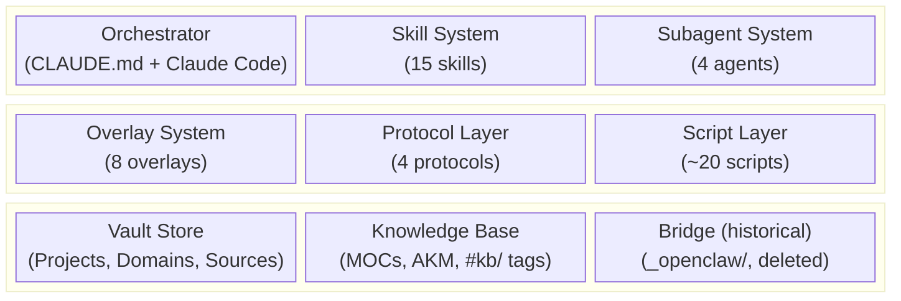
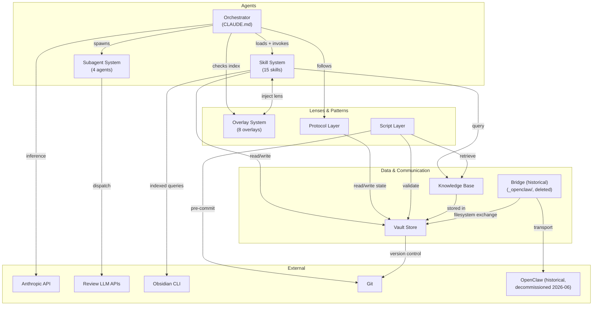

# 02 — Building Blocks

This section decomposes the Crumb/Tess system into its constituent subsystems, maps ownership and write authority, and documents the dependency relationships between blocks.

**Source attribution:** Synthesized from the design spec ([[crumb-design-spec-v2-4]] §1–§3, §5), ownership routing from `tess-crumb-boundary-reference.md` and function tables from `tess-crumb-comparison.md` (both retired 2026-07-03, vault-optimization B3 — git history), and live directory scans of the vault.

---

## L1 Decomposition

The system is built from nine top-level building blocks. Each block has a single primary owner (the agent responsible for its creation and maintenance) and well-defined vault locations.

### Prose Summary (for environments that cannot render Mermaid)

Nine building blocks in three tiers. **Agents tier:** the Orchestrator (CLAUDE.md governance + Claude Code runtime), Skill System (15 procedural packages), and Subagent System (4 isolated workers). **Lenses & Patterns tier:** Overlay System (8 expert lenses), Protocol Layer (4 cross-cutting workflow patterns), and Script Layer (~20 mechanical enforcement and automation scripts). **Data & Communication tier:** Vault Store (the shared filesystem — Projects, Domains, Sources, system docs), Knowledge Base (MOCs, AKM/QMD retrieval, tag taxonomy), and Bridge — **historical (decommissioned 2026-06):** formerly Tess-Crumb communication via `_openclaw/`, now deleted from disk (agentic-sunset).

---

## L2 Decomposition

### 1. Orchestrator

The Claude Code main session governed by CLAUDE.md. Not a separate entity — Claude Code IS the orchestrator.

| Component | Location | Purpose |
|-----------|----------|---------|
| CLAUDE.md | `/CLAUDE.md` | Governance surface: routing rules, protocols, behavioral boundaries, risk tiers. ~350 lines. Loaded every session. |
| AGENTS.md | `/AGENTS.md` | Tool-agnostic context. Works with any AI, not just Claude Code. |
| Routing rules | Inline in CLAUDE.md | Domain classification, workflow depth selection, prompt triage (FULL/ITERATION/MINIMAL) |
| Risk-tiered approval | Inline in CLAUDE.md | Low → auto-approve, Medium → proceed + flag, High → stop and ask |

**Key insight:** The orchestrator's intelligence comes from Claude's built-in judgment plus CLAUDE.md's routing rules. There is no separate "orchestrator agent" or "delegate mode."

### 2. Skill System

Procedural expertise packages loaded on-demand based on description match.

| Skill | Phase | Purpose |
|-------|-------|---------|
| systems-analyst | SPECIFY | Problem analysis → specification |
| action-architect | TASK/PLAN | Spec → milestones, tasks, dependencies |
| writing-coach | Any output | Clarity, structure, tone improvement |
| audit | Maintenance | Staleness scans, full audits, health checks |
| sync | Session mgmt | Git commit, backup operations |
| startup | Session mgmt | Session startup hook procedures |
| peer-review | Review | Cross-LLM artifact validation (multi-model panel) |
| code-review | Review | Two-tier: Claude Opus (API) + Codex (CLI) |
| critic | Review | Adversarial review — unsupported claims, logical gaps, missing perspectives (single-stage structured critique) |
| deliberation | Review | Multi-agent deliberation on vault artifacts — dispatches to external LLM evaluators with role-specific overlays |
| inbox-processor | Intake | Process `_inbox/` files — classify, route |
| researcher | Research | 6-stage evidence pipeline with citation integrity |
| mermaid | Diagrams | Default diagramming — Mermaid in markdown + Excalidraw for freeform/sketch layouts |
| deck-intel | Extraction | Structured intel from PPTX/PDF; visual content interpretation (absorbed diagram-capture, VO B5) |
| vault-query | Cross-cutting | Structured vault queries for dispatch consumers |

**Location:** `.claude/skills/[name]/SKILL.md` — each skill is a single markdown file with YAML frontmatter (identity, procedure, context contract, quality checklist, compound behavior, convergence dimensions). Some skills have reference subdirectories (researcher has `stages/` and `schemas/`).

**Loading:** Claude Code auto-matches skill descriptions to user requests. Skills with `model_tier: execution` delegate to Sonnet subagents. Skills without `model_tier` run on the session model (Opus).

### 3. Subagent System

Isolated context workers for tasks that benefit from separation from the main session.

| Agent | Purpose | Consumers |
|-------|---------|-----------|
| code-review-dispatch | Review panel dispatch: Claude Opus (API) + Codex (CLI) | code-review skill |
| peer-review-dispatch | Multi-model prose review panel dispatch | peer-review skill |
| deliberation-dispatch | Role-specific overlay + persona-biased evaluator dispatch with concurrent API calls | deliberation skill |
| test-runner | Test suite execution in external repos (TypeScript, Node native, pytest) | code-review skill |

**Location:** `.claude/agents/[name].md`

**Spawning:** Main session spawns subagents via the Agent tool. Each subagent gets its own context window. Returns a summary to the main session. One revision pass allowed before escalating to human gate (Subagent Revision Protocol, spec §3.2.4).

### 4. Overlay System

Expert lenses that inject domain expertise into active skills. No procedures of their own.

| Overlay | Domain | Primary Signals |
|---------|--------|-----------------|
| Business Advisor | Cross-cutting | Cost/benefit, market positioning, pricing, competitive dynamics |
| Career Coach | Career | Skill gaps, trajectory planning, stakeholder strategy |
| Life Coach | Personal | Values clarification, life direction, habit change |
| Financial Advisor | Financial | Budgeting, investment, tax, financial planning |
| Design Advisor | Creative | Visual design, dataviz, information architecture |
| Web Design Preference | Software | UI aesthetic preferences, CSS patterns |
| Network Skills | Career | DNS, DHCP/IPAM, SASE/SSE, zero trust |
| Glean Prompt Engineer | Software | Glean search app prompt engineering |

**Location:** `_system/docs/overlays/[name].md` — each under 65 lines. Routed via `overlay-index.md` (loaded at session start).

**Companion documents:** Some overlays have standing reference docs that auto-load alongside them (Design Advisor dataviz companion, Life Coach personal philosophy, Network Skills vendor catalog).

### 5. Protocol Layer

Cross-cutting workflow patterns invoked by skills or the orchestrator. Not standalone entities.

| Protocol | Location | Purpose |
|----------|----------|---------|
| Context Checkpoint | `_system/docs/context-checkpoint-protocol.md` | Phase transition procedure: compound eval → context check → log → state update |
| Session-End | `_system/docs/protocols/session-end-protocol.md` | Autonomous session close: log → failure-log → code review sweep → commit → push |
| Hallucination Detection | `_system/docs/protocols/hallucination-detection-protocol.md` | Tiered detection: always-on, risk-proportional, audit-time, monthly |
| Inline Attachment | `_system/docs/protocols/inline-attachment-protocol.md` | Binary artifact handling during project sessions |

**Additional protocols defined inline in CLAUDE.md:** Compound Step Protocol (spec §4.4), Convergence Protocol (spec §4.2), Risk-Tiered Approval Gates (spec §4.3), Project Archive/Reactivate (spec §4.6).

### 6. Vault Store

The shared filesystem. All state, all communication, all persistence.

| Directory | Purpose | Owner |
|-----------|---------|-------|
| `Projects/` | Active project scaffolds (state, specs, plans, tasks, logs, design, reviews, research, attachments) | Crumb |
| `Archived/Projects/` | Archival target — recreated on next project archival (directory absent when empty; deleted 2026-07-03, vault-optimization B1) | Crumb (archive/reactivate) |
| `Domains/` | Domain overview notes and MOC files organized by life domain (Career, Health, Learning, etc.) | Crumb |
| `Sources/` | Knowledge notes from external sources — books, articles, podcasts, videos, courses, papers. Plus `signals/` for promoted signal-notes (formerly feed-pipeline output) | Crumb |
| `_system/docs/` | System infrastructure: design spec, protocols, overlays, solutions, templates, personal context | Crumb |
| `_system/logs/` | Operational logs: session-log, AKM feedback, backup/health status, service metrics | Crumb (session-log); Scripts (metrics) |
| `_system/scripts/` | Mechanical enforcement and automation scripts | Crumb |
| `_system/reviews/` | System-level peer and code review notes + raw JSON responses | Crumb (via peer-review/code-review skills) |
| `_inbox/` | Drop zone for manually added files — processed by inbox-processor | Danny (drops); Crumb (processes) |
| `_attachments/` | Permanent storage for unaffiliated binary files after processing | Crumb (via inbox-processor) |
| `_openclaw/` | *(Historical — decommissioned 2026-06; directory deleted from disk, agentic-sunset)* Bridge transport, Tess workspace, feed intel (see Bridge block below) | Tess |
| `.claude/` | Skills and agents (Claude Code convention) | Crumb |

### 7. Knowledge Base Layer

The semantic layer built on top of the Vault Store. Provides discovery, retrieval, and cross-referencing.

| Component | Location | Purpose |
|-----------|----------|---------|
| `#kb/` tag taxonomy | Tags on vault files | 18 canonical Level 2 tags. Level 3 subtags are open. Marks durable knowledge. |
| MOC system | `Domains/*/moc-*.md` | Maps of Content — navigational indexes per knowledge domain. 15 built MOCs. |
| AKM (Active Knowledge Memory) | `_system/scripts/knowledge-retrieve.sh` | QMD-backed semantic retrieval. Knowledge Brief at session start (5 items). Skill-activation retrieval (3 items). Decay-based relevance scoring. |
| Source indexes | `Sources/*/[source-id]-index.md` | Per-source landing pages aggregating child knowledge notes |
| `kb-to-topic.yaml` | `_system/docs/kb-to-topic.yaml` | Canonical `#kb/` tag → MOC slug mapping. Single source of truth for automated routing. |
| `topics` field | Frontmatter on `#kb/`-tagged notes | Links notes to MOCs. Enforced by vault-check. |

**Retrieval path:** AKM script → QMD semantic search → Knowledge Brief → session context. Three trigger modes: session-start (cross-domain), skill-activation (project-scoped), new-content (cross-pollination).

### 8. Script Layer

Mechanical enforcement and automation. Bash and Python scripts that run outside Claude Code's context.

| Script | Trigger | Purpose |
|--------|---------|---------|
| `vault-check.sh` | Pre-commit hook; audit skill | 26 structural validation checks. The system's only external enforcement. |
| `session-startup.sh` | SessionStart hook | Git pull, backup-retention prune, vault-check deferred to pre-commit, Obsidian CLI probe, rotation-check data (stale summaries, session-log month, run-log rotation, last audit) |
| `knowledge-retrieve.sh` | Session start; skill activation | AKM retrieval engine — QMD search + Knowledge Brief |
| `skill-preflight.sh` | PreToolUse hook | KB-eligible skill activation → knowledge injection |
| `mirror-sync.sh` | Cron | Vault mirror sync to secondary location |
| `vault-backup.sh` | Cron | Cloud backup trigger |
| `system-stats.sh` | Cron | System resource metrics |
| `setup-crumb.sh` | Manual (new machine) | Full environment setup |

Plus: `dns-recon.sh`, `vault-gc.sh`, `setup-crumb.sh`, and others. (Retired scripts — `bridge-watcher.py`, `tess-health-check.sh`, `batch-moc-placement.py`, `vault-search.sh` — deleted 2026-07-03, vault-optimization B4; git history.)

### 9. Bridge

> **Historical (decommissioned 2026-06):** The Tess-Crumb communication layer described below was decommissioned by agentic-sunset (2026-06-01 → 2026-06-12), reboot-verified absent 2026-06-14. `_openclaw/` (all 16 subdirectories listed below) is deleted from disk. Kept as architecture history — there is no bridge, and no second agent, today.

The Tess-Crumb communication layer. All inter-agent communication flows through the filesystem.

| Directory | Direction | Purpose |
|-----------|-----------|---------|
| `_openclaw/inbox/` | Tess → Crumb | Tess stages requests. Bridge watcher detects and triggers dispatch. |
| `_openclaw/outbox/` | Crumb → Tess | Bridge processor writes responses. Tess delivers to Telegram. |
| `_openclaw/transcripts/` | Record | Crumb writes dispatch transcripts. Vault commit history is authoritative. |
| `_openclaw/tess_scratch/` | Bidirectional | Ephemeral file exchange outside bridge protocol. Group-writable, gitignored. |
| `_openclaw/state/` | Tess → Crumb | Apple integration snapshots (reminders, calendar, notes) written by LaunchAgent. |
| `_openclaw/feeds/` | External → Tess | RSS/feed content for feed-pipeline processing |
| `_openclaw/data/` | Tess | FIF SQLite database, dashboard state |
| `_openclaw/config/` | Tess | OpenClaw gateway configuration |
| `_openclaw/scripts/` | Tess | Tess-owned operational scripts (awareness-check, cron jobs) |
| `_openclaw/alerts/` | Tess | Alert delivery queue |
| `_openclaw/dispatch/` | Bridge | Dispatch stage working files |
| `_openclaw/staging/` | Ops | Deployment staging area |

**Security boundary (historical):** Filesystem permissions. The `openclaw` macOS user (running Tess) had group-read on the vault and write access to `_openclaw/`. The `tess` macOS user (running Crumb) owned the vault. Neither agent invoked the other directly. Post-migration, `danny` is the current macOS account owning the vault and running Crumb; the `openclaw` account's runtime role ended with the decommission.

---

## Ownership Map

> **Historical note:** The Tess Voice / Tess Mechanic columns below reflect the pre-decommission three-agent model (decommissioned by agentic-sunset, 2026-06-01 → 2026-06-12, reboot-verified absent 2026-06-14). Current reality: Crumb and Danny are the only rows/columns still live; `_openclaw/*` paths no longer exist.

Who can read and write what. This is the authority model that governs all vault operations.

### Write Authority

| Building Block | Crumb | Tess Voice | Tess Mechanic | Danny | Scripts |
|---------------|-------|------------|---------------|-------|---------|
| **Projects/** | Full governed | — | — | `_inbox/` drop | — |
| **Domains/** | Full governed | — | — | — | — |
| **Sources/** | Full governed | — | — | — | Batch pipeline |
| **_system/docs/** | Full governed | — | — | — | — |
| **_system/logs/** | Session-log, run-log | — | — | — | Metrics, health |
| **_system/scripts/** | Full governed | — | — | — | — |
| **.claude/** | Skills, agents | — | — | — | — |
| **_inbox/** | Process + route | — | — | Drop files | — |
| **_attachments/** | Process + store | — | — | — | — |
| **_openclaw/inbox/** | Read (dispatch) | Write (relay) | — | — | — |
| **_openclaw/outbox/** | Write (respond) | Read (deliver) | — | — | — |
| **_openclaw/state/** | Read | — | Write (snapshots) | — | Cron scripts |
| **_openclaw/feeds/** | Read (pipeline) | Write (ingest) | Write (RSS) | — | — |
| **_openclaw/data/** | Read | Read/Write | Read/Write | — | — |
| **_openclaw/tess_scratch/** | Read/Write | Read/Write | — | Read/Write | — |

### Capability Ownership

Which agent owns which system capability. "Owns" means sole authority to execute; "assists" means can participate but not initiate.

| Capability | Owner | Assists |
|-----------|-------|---------|
| Architecture decisions | Crumb | — |
| Design specs & governed projects | Crumb | — |
| Phase gate execution | Crumb | Tess (relays approval via bridge) |
| Convergence & peer review | Crumb | — |
| Compound engineering | Crumb | — |
| Skill/overlay/primitive creation | Crumb | — |
| Vault structure governance | Crumb | — |
| Session logging | Crumb | — |
| Code review | Crumb | — |
| Inbox triage | Tess Voice | — |
| Quick lookups & status | Tess Voice | Crumb (can, but expensive) |
| Monitoring & automation | Tess Mechanic | — |
| Telegram communication | Tess Voice | — |
| Bridge relay | Tess Voice | Crumb (dispatch processing) |
| Heartbeat checks | Tess Mechanic | — |
| Approval authority | Danny | — |

---

## Dependency Diagram

### Prose Summary (for environments that cannot render Mermaid)

The Orchestrator (CLAUDE.md + Claude Code) is the root: it loads and invokes skills, spawns subagents, checks the overlay index, and follows protocols. All four depend on the Vault Store for read/write operations.

Skills read and write the vault, query the Knowledge Base, and receive optional overlay lens injection. Subagents dispatch to external LLM APIs for review. Protocols read and write vault state during workflow transitions.

The Script Layer validates the vault (vault-check), retrieves knowledge (AKM), and triggers git operations (pre-commit). The Knowledge Base is stored in the vault but provides a semantic retrieval layer on top of raw file access.

*(Historical — decommissioned 2026-06):* The Bridge connected to the vault via filesystem exchange and to the external OpenClaw gateway for Tess transport; both are gone. The Orchestrator depends on the Anthropic API for inference. Skills use the Obsidian CLI for indexed queries. The vault is version-controlled via Git.

**Critical path:** Anthropic API → Orchestrator → Skills → Vault Store. If Anthropic is down, Crumb is fully non-functional. *(Historical: Tess Mechanic, local Ollama, used to continue independently — no longer applicable; there is no second agent.)*

---

## Code Mapping

Where each building block lives on disk, for navigation.

| Block | Primary Path(s) | File Count |
|-------|-----------------|------------|
| Orchestrator | `/CLAUDE.md`, `/AGENTS.md` | 2 |
| Skills | `.claude/skills/*/SKILL.md` | 15 directories |
| Subagents | `.claude/agents/*.md` | 4 files |
| Overlays | `_system/docs/overlays/*.md` | 9 files (incl. index) |
| Protocols | `_system/docs/protocols/*.md` + `_system/docs/context-checkpoint-protocol.md` | 4 files |
| Vault Store | `Projects/`, `Domains/`, `Sources/`, `_system/`, `_inbox/`, `_attachments/` | ~3650 files |
| Knowledge Base | `Domains/*/moc-*.md`, `_system/docs/kb-to-topic.yaml`, `_system/scripts/knowledge-retrieve.sh` | 15 MOCs + scripts |
| Scripts | `_system/scripts/` | ~20 files |
| Bridge *(historical — decommissioned 2026-06, directory deleted)* | `_openclaw/` | 16 subdirectories (as it existed pre-deletion) |
