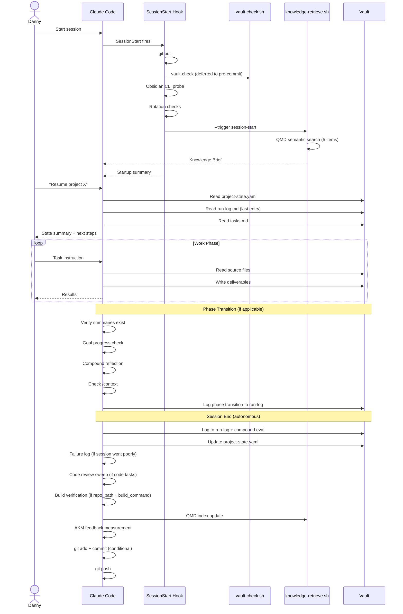
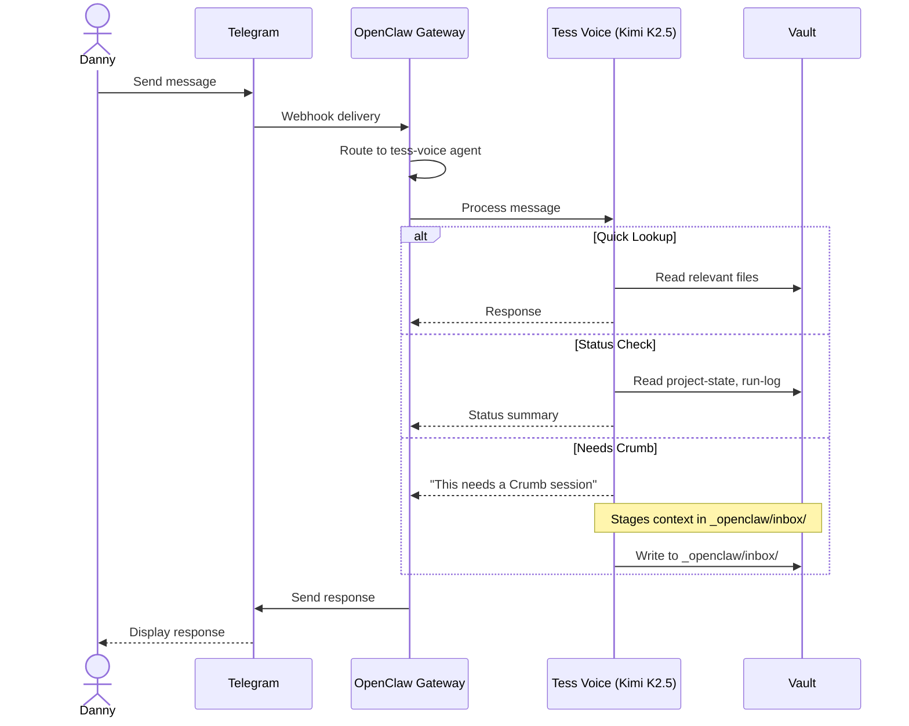
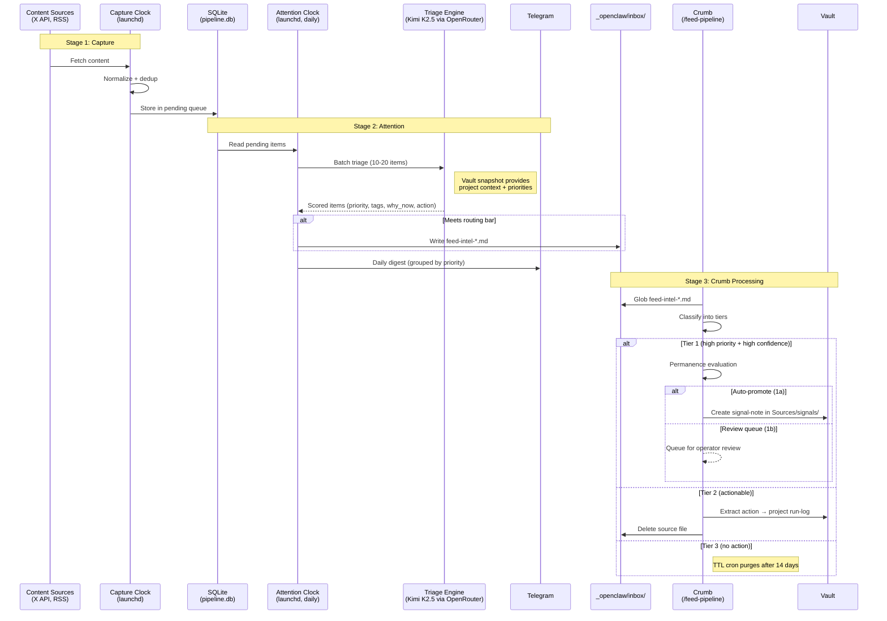
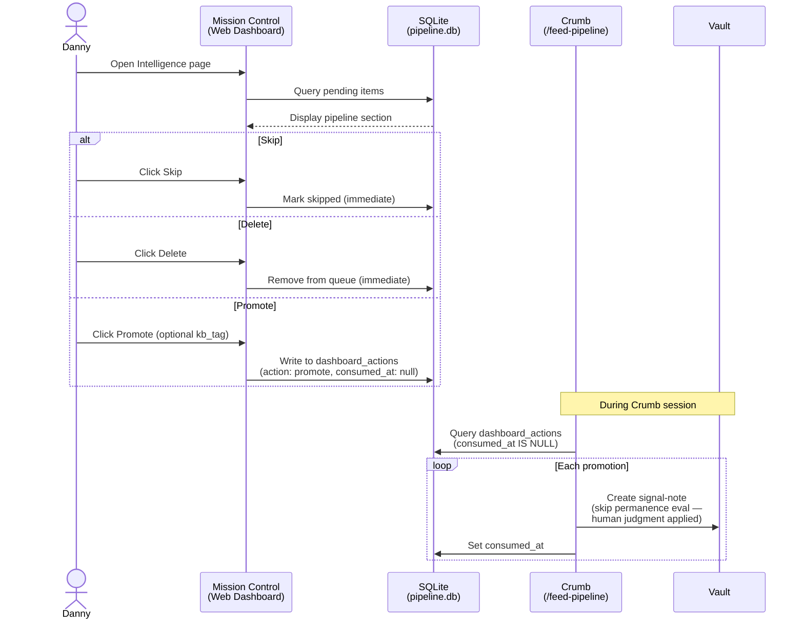
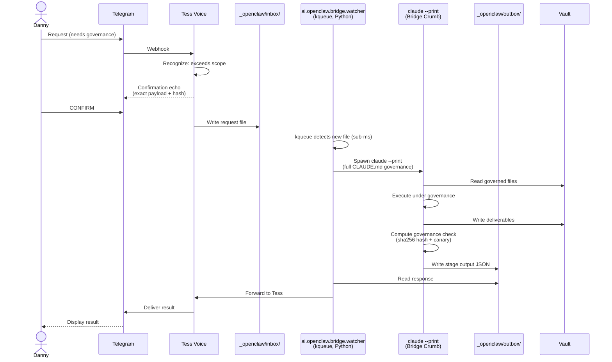
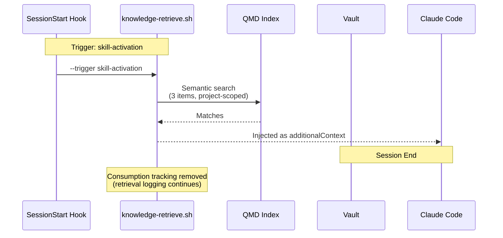

# 03 — Runtime Views

This section documents six key runtime flows through the system as sequence diagrams with prose summaries. Each flow covers the happy path and notes failure handling where relevant.

**Source attribution:** Synthesized from the design spec ([[crumb-design-spec-v2-4]] §4.1, §6, §7.1), [[context-checkpoint-protocol]], [[session-end-protocol]], [[bridge-dispatch-protocol]], the feed-intel processing chain (formerly [[feed-intel-processing-chain]] and [[feed-intel-processing-chain-diagram]]), [[fif-triage-and-signals]], and the AKM design in spec §5 and `knowledge-retrieve.sh`.

---

## 1. Session Lifecycle

A Crumb session from startup through work to session end. This is the most common runtime flow.

### Prose Summary

**Startup:** The SessionStart hook runs automatically — git pull, vault-check (deferred to pre-commit), Obsidian CLI availability check, rotation checks, and the AKM Knowledge Brief (5 cross-domain items via QMD semantic search with decay-based relevance scoring).

**Resume:** Claude reads `project-state.yaml` for phase/task state, the last run-log entry for narrative context, and `tasks.md` for remaining work. Presents a state summary and waits for confirmation.

**Work:** Tasks execute within the current phase. Claude reads source files, writes deliverables, and reports results. Context management is autonomous (compact at >70%, clear+reconstruct at >85%).

**Phase transition:** Context Checkpoint Protocol runs: verify summaries → goal progress check → compound reflection → context check → log transition. Compound reflection is structurally enforced at every phase boundary.

**Session end (autonomous, 9 steps):** Log with compound eval → project state refresh → failure log (conditional) → code review sweep (conditional) → build verification (conditional) → AKM feedback + QMD update → inbox sweep → conditional commit → git push.

**Failure handling:** If context exhausts mid-work: `/compact` or `/clear` + vault reconstruction. If a skill fails to load: retry once, degrade, then escalate. If the session crashes: Session Interruption Recovery (spec §7.4) reconciles filesystem state against run-log on next resume.

---

## 2. Tess Dispatch (Telegram Interaction)

How a Telegram message from Danny reaches Tess and gets a response.

### Prose Summary

Danny sends a Telegram message. The Telegram API delivers it to the OpenClaw gateway via webhook. The gateway routes it to the tess-voice agent (Kimi K2.5 via OpenRouter, with Qwen 3.6 failover).

**Interactive dispatch (Amendment Z, tess-v2 Phase IMPLEMENT as of 2026-04-11):** The dispatch flow is evolving toward an orchestrator-driven interactive model where Tess Voice can request multi-turn clarification via the bridge before committing a governed operation. Amendment Z peer-reviewed (two rounds). Phase A end-to-end loop completed 2026-04-06. Current sequence diagram reflects the stabilized quick-lookup / status-check / needs-Crumb paths — interactive-dispatch refinements are in active soak and may adjust the diagram in a later refresh.

**Quick lookups:** Tess reads vault files directly and responds. **Status checks:** Tess reads project-state.yaml and recent run-log entries, formats a summary. **Governed work:** Tess recognizes the request exceeds her scope (architecture decisions, governed file modifications, convergence/peer review), stages context in `_openclaw/inbox/`, and responds "This needs a Crumb session."

Tess reads the full vault but writes only to `_openclaw/` directories. No governed vault modifications happen through this flow.

**Failure handling:** OpenRouter handles primary→failover routing at the gateway layer (Kimi K2.5 → Qwen 3.6). If both cloud endpoints are unavailable, tess-voice falls back to limited mode (local Nemotron via `com.tess.llama-server` with reduced scope). If the OpenClaw gateway is down, Telegram messages queue in Telegram's infrastructure until the gateway recovers.

---

## 3. Feed Pipeline

Content capture through triage to vault promotion. Three stages, two clocks, two agents.

### Prose Summary

**Stage 1 (Capture Clock):** LaunchAgent jobs fetch content from configured sources (X API v2 bookmarks, TwitterAPI.io search, RSS). Content is normalized to a unified format, deduped against SQLite, and queued. Runs on per-adapter schedules, decoupled from delivery.

**Stage 2 (Attention Clock):** Runs daily. Batches pending items (10–20 per LLM call) through the cloud triage engine (Kimi K2.5 via OpenRouter; Qwen 3.6 failover). Each item gets: priority, tags, `why_now` rationale, recommended action, confidence. A vault snapshot (project frontmatter, operator priorities, recent session summaries) provides triage context. Items meeting the routing bar land in `_openclaw/inbox/`. All items go to a Telegram digest.

**Stage 3 (Crumb Processing):** The `/feed-pipeline` skill processes the inbox. Tier 1 (high priority + high confidence + capture action) gets permanence evaluation — auto-promote to `Sources/signals/` as signal-notes (1a) or route to operator review queue (1b). Circuit breaker: >10 Tier 1 items routes all to review queue (classifier drift signal). Tier 2 (actionable items) gets one-line action extracted and routed to project run-logs. Tier 3 gets no action; TTL cron purges after 14 days.

**Feedback loop:** Telegram digest supports inline commands (promote, save, research, ignore). `save` routes to `_openclaw/feeds/kb-review/` for Crumb review. `research` dispatches a bridge research job.

**Failure handling:** Capture and attention clocks are decoupled — capture failures don't block delivery. Triage failures leave items in pending queue for next run. Crumb processing failures leave items in inbox (idempotent — reprocessing is safe due to filename-based dedup).

---

## 4. Mission Control Dashboard

The web dashboard for feed triage and pipeline visibility.

### Prose Summary

The Mission Control Intelligence page surfaces the FIF pipeline section. Danny can **skip** (immediate, no vault write), **delete** (immediate, removes from queue), or **promote** (queues a row in `dashboard_actions` with optional `kb_tag` override).

During a Crumb session, the `/feed-pipeline` skill's Step 0 queries `dashboard_actions` for unconsumed promotions. Because human judgment was already applied at the dashboard, these skip the permanence evaluation and go straight to signal-note creation. Each consumed promotion gets its `consumed_at` timestamp set.

The dashboard is served from `~/openclaw/crumb-dashboard` via Cloudflare Tunnel + Access. Telegram digest is transitioning to notification-only as the dashboard matures.

**Failure handling:** Dashboard actions are durable in SQLite — if a Crumb session fails mid-processing, unconsumed promotions remain in the queue for the next session.

---

## 5. Bridge Handoff (Tess → Crumb → Tess)

How a governed request flows from Telegram through the bridge to Crumb and back.

### Prose Summary

Danny sends a request via Telegram that requires governed vault operations (architecture decisions, project file modifications, etc.). Tess Voice recognizes it exceeds her scope.

**Confirmation echo:** Before acting, Tess displays the exact payload she's about to relay plus a hash, and waits for explicit CONFIRM from Danny. This prevents unintended bridge writes.

**Bridge transport:** Tess writes the request to `_openclaw/inbox/`. The bridge-watcher (persistent Python process using kqueue) detects the new file in sub-milliseconds and spawns `claude --print` with full CLAUDE.md governance loaded.

**Governed execution:** The bridge Crumb session reads vault files, executes the requested operation under identical governance rules as an interactive session, computes a governance check (SHA-256 hash of CLAUDE.md + canary stamp), and writes structured JSON output to `_openclaw/outbox/`.

**Response delivery:** The bridge-watcher reads the response, forwards it to Tess Voice, which delivers the result to Danny via Telegram.

**Security (4-layer):** Schema validation (request structure), payload hashing (canonical JSON), confirmation echo (write operations), post-processing governance verification (hash + canary in output).

**Kill switch:** Touching `_openclaw/.bridge-disabled` disables all bridge processing.

**Failure handling:** If `claude --print` fails, the bridge-watcher logs the error. The request file remains in inbox for manual review. If governance verification fails (hash mismatch), the output is rejected. `bestEffort` mode on delivery means Tess reports success even if Telegram delivery fails — a known triple-silent-failure pattern (documented in MEMORY.md).

---

## 6. AKM Surfacing (Knowledge Brief)

How the Active Knowledge Memory retrieves and surfaces relevant vault knowledge.

### Prose Summary

**Skill-activation retrieval:** Fires before every skill invocation for KB-eligible skills (automated via PreToolUse hook and `skill-preflight.sh`). Retrieves 3 project-scoped items and injects them as `additionalContext`. This is the primary AKM retrieval path — it has real context (project, task, skill) to target against.

**New-content trigger:** When new knowledge enters the vault (source ingestion, signal-note promotion), AKM surfaces 5 cross-pollination candidates — items from other domains that might relate to the new content.

**Feedback loop:** Removed. The Read-tool-based hit-rate metric was structurally flawed — briefs are consumed in context without triggering a Read on the source file, so all sessions showed 0% hit rate. Retrieval logging (what was surfaced and when) continues in `akm-feedback.jsonl` for QMD tuning.

**Failure handling:** AKM failures are non-blocking. If QMD is unavailable or returns no results, the session proceeds without a Knowledge Brief. The feedback script skips if no AKM entries exist for the day.
