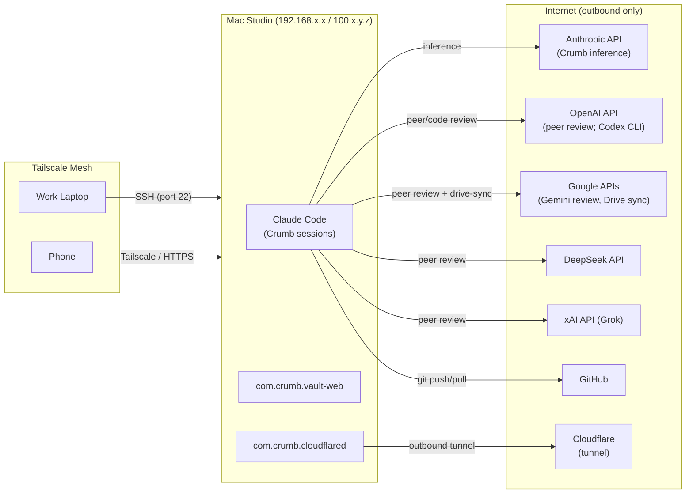
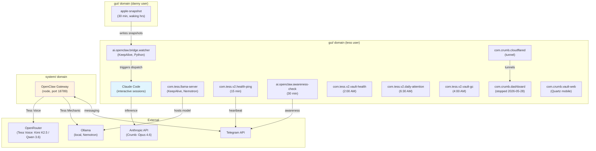
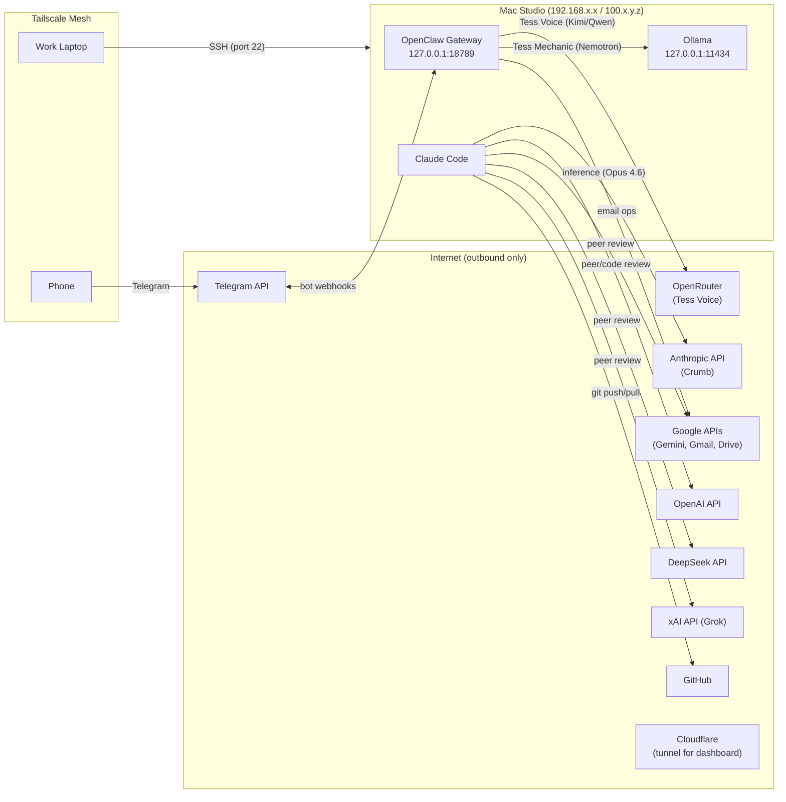

# 04 — Deployment

This section describes the physical hosting, process model, network topology, storage layout, credential management, and DNS configuration of the system. It is organized in two parts:

- **Part I — Current Deployment:** what actually runs today — single operator account, interactive Claude Code sessions, and the `com.crumb.*` LaunchAgent keep-set.
- **Part II — Historical: OpenClaw-Era Deployment:** the two-namespace Tess/OpenClaw runtime — gateway LaunchDaemon, bridge-watcher, `ai.openclaw.*`/`com.tess.v2.*` namespaces, `_openclaw/` staging — decommissioned by project agentic-sunset (2026-06-01 → 2026-06-12), reboot-verified absent 2026-06-14. Kept as architecture history.

**Source attribution:** Synthesized from the design spec ([[crumb-design-spec-v2-4]] §7, §9), [[crumb-deployment-runbook]], [[crumb-studio-migration]], the openclaw-colocation-spec (retired 2026-06-12, full text in git history at `_system/docs/openclaw-colocation-spec.md`), and live system state (`~/Library/LaunchAgents/` + `launchctl list`, verified 2026-07-07).

---

# Part I — Current Deployment (2026-07-07)

## Host

Single physical host: **Mac Studio M3 Ultra** (96 GB RAM, 1 TB SSD, macOS 15+).

Single macOS account: **`danny`** — owns the vault (`/Users/danny/crumb-vault`), runs Crumb (interactive Claude Code sessions), and hosts all `com.crumb.*` LaunchAgents. The former `tess` operator account and `openclaw` service account lost their runtime roles with the agentic-sunset decommission — see Part II.

**Remote access:** SSH via Tailscale mesh network. No public internet exposure. Client machines (work laptop, phone) connect through Tailscale's WireGuard tunnel using MagicDNS hostnames or direct Tailscale IPs (`100.x.y.z`).

**Terminal stack:** SSH → tmux (session persistence, `Ctrl+A` prefix, Catppuccin Mocha theme) → Claude Code (native installer, not npm).

## Process Model

Two kinds of processes:

1. **Interactive Claude Code sessions** — on-demand, not persistent. Crumb runs only while danny has a session open (or via narrow scheduled `claude --print` automation).
2. **The `com.crumb.*` LaunchAgent keep-set** (agentic-sunset keep-set manifest) — 11 plists on disk, 10 loaded; `com.crumb.dashboard` is retained but intentionally unloaded (parked).

All services run in danny's `gui/` launchd domain. Plists deploy to `~/Library/LaunchAgents/`.

### Keep-Set Inventory

Verified against `~/Library/LaunchAgents/` and `launchctl list`, 2026-07-07:

| Label | Schedule | Loaded | Purpose |
|-------|----------|--------|---------|
| `com.crumb.vault-web` | KeepAlive | yes | Quartz v4 static site for mobile vault access |
| `com.crumb.cloudflared` | KeepAlive | yes | Cloudflare tunnel for remote dashboard access (currently points at the parked dashboard) |
| `com.crumb.dashboard` | KeepAlive | **no — parked** | Mission Control HTTP server. On disk, intentionally unloaded (mission-control paused 2026-06-14). |
| `com.crumb.vault-health` | 2:00 AM daily | yes | Nightly vault integrity check |
| `com.crumb.vault-backup` | 3:00 AM daily | yes | Vault state snapshot to cloud storage |
| `com.crumb.vault-gc` | 4:00 AM daily | yes | Vault garbage collection |
| `com.crumb.drive-sync` | 5:00 AM daily | yes | Sync docs to Google Drive for NotebookLM ingestion |
| `com.crumb.qmd-index` | 5:30 AM daily | yes | AKM/QMD index maintenance |
| `com.crumb.backup-status` | Every 900 s | yes | Backup state monitoring |
| `com.crumb.vault-rebuild` | Every 900 s | yes | Vault rebuild |
| `com.crumb.system-stats` | Every 60 s | yes | System resource metrics |

**Project-registered services:** Projects with `repo_path` in `project-state.yaml` may list service labels in a `services` field. Session-end build verification restarts these services after code changes.

**Telegram alerting note:** `vault-health` and `backup-status` inherited Telegram notification paths from their `com.tess.v2.*` predecessors — Telegram usage should be reconfirmed at the next deployment review (see Credential Management).

## Network Topology



### Prose Summary (for environments that cannot render Mermaid)

The Mac Studio has no inbound ports open to the public internet. All remote access uses Tailscale's WireGuard mesh (encrypted, authenticated, NAT-traversing) — SSH (port 22) from Tailscale peers only.

**Loopback services:** none remain. The OpenClaw gateway (`127.0.0.1:18789`) and Ollama (`127.0.0.1:11434`) went away with the decommission (Part II).

**Outbound traffic:**
- Anthropic API (Crumb inference — top-tier frontier models, see crumb-model-policy)
- OpenAI, Google, DeepSeek, xAI APIs (peer-review panel; OpenAI also serves the Codex CLI used by review-panel)
- Google APIs (Drive sync for NotebookLM)
- GitHub (vault and project repo operations)
- Cloudflare (outbound tunnel for dashboard remote access — tunnel is live; the dashboard behind it is parked)

## Storage Layout

```
/Users/danny/
├── crumb-vault/                    # THE VAULT — Obsidian + git-tracked
│   ├── Projects/                   # Active project scaffolds
│   ├── Archived/Projects/          # Archival target — recreated on archival (absent when empty)
│   ├── Domains/                    # 8 life domain directories
│   ├── Sources/                    # Knowledge notes (books, articles, signals)
│   ├── _system/                    # Infrastructure (docs, scripts, logs, reviews)
│   ├── _inbox/                     # Universal manual-drop intake
│   ├── _attachments/               # Unaffiliated binary storage
│   ├── .claude/                    # Skills, agents, settings
│   ├── .git/                       # Version history (markdown only)
│   ├── CLAUDE.md                   # Governance surface
│   └── AGENTS.md                   # Tool-agnostic context
├── crumb-vault-mirror/             # GitHub mirror (read-only, for claude.ai)
├── Library/LaunchAgents/           # com.crumb.* keep-set plists
└── .config/crumb/.env              # API keys (mode 600)
```

### Git Tracking Strategy

The vault is git-tracked for markdown version history. Binary files are excluded:

```gitignore
# Binary attachments — tracked via companion notes
*.pdf  *.docx  *.pptx  *.xlsx
*.png  *.jpg  *.jpeg  *.gif  *.webp  *.svg
```

Companion notes (markdown) ARE tracked — they carry the metadata, description, and references for each binary. The binary itself doesn't benefit from diff-based history.

**Binary durability:** Git does not protect binaries. A separate sync/backup mechanism (Time Machine, iCloud, Obsidian Sync) is required for binary survival.

### Backup

| Mechanism | Scope | Frequency | Location |
|-----------|-------|-----------|----------|
| Git push | Vault markdown | Session-end (conditional) | GitHub (private repo) |
| GitHub mirror sync | Vault markdown | Automated (`mirror-sync.sh`) | `crumb-vault-mirror/` → GitHub (public-safe subset) |
| Time Machine | Full disk | Continuous | External/network drive |
| Vault backup | Vault state snapshot | launchd (`com.crumb.vault-backup`, 3:00 AM) | Cloud storage |

## Credential Management

All credentials live in the `danny` account (migrated from `tess` pre-decommission). Historical credentials for the decommissioned runtime are listed in Part II.

| Credential | Storage | Consumer | Rotation |
|-----------|---------|----------|----------|
| Anthropic API key | macOS Keychain | Claude Code (Crumb) | Manual |
| OpenAI API key | `~/.config/crumb/.env` | peer-review, review-panel skills | Manual |
| Google/Gemini API key | `~/.config/crumb/.env` | peer-review skill | Manual |
| DeepSeek API key | `~/.config/crumb/.env` | peer-review skill | Manual |
| xAI/Grok API key | `~/.config/crumb/.env` | peer-review skill | Manual |
| GitHub PAT | macOS Keychain (credential-osxkeychain) | Git push/pull | Auto-cached |
| Telegram bot tokens | LaunchAgent plist env vars | `vault-health` / `backup-status` alerting — usage should be reconfirmed at next deployment review | Manual |
| Cloudflare tunnel token | macOS Keychain | cloudflared tunnel | Manual |
| X (Twitter) OAuth | Dynamic (Keychain refresh) | **Orphaned** — consumer (FIF) archived 2026-07-05, concept moved to Claude Cowork; revocation pending | Auto-refresh |

### Security Model

- `~/.config/crumb/.env` owned by danny, mode 600 (no group/other read).
- Review safety denylist (`_system/docs/review-safety-denylist.md`) prevents sensitive content in peer/code review dispatches to external APIs. Still enforced.
- Single-account model: no cross-user credential isolation remains. The two-user OpenClaw isolation model (dedicated service account, group-scoped vault access) is historical — see Part II.

**Known constraints:**
- `sudo -u <user>` does NOT carry TCC grants. Apple integrations require a LaunchAgent in the owning user's GUI domain, not cross-user sudo.
- Keychain may prompt for API keys during first SSH session — resolve interactively before automating.
- X OAuth tokens rotate — static env files can't hold them. Dynamic store (Keychain refresh) required.
- `com.apple.provenance` xattr causes `launchctl bootstrap` failures on macOS 15+. Must strip as the absolute last operation before bootstrap.

## DNS

The system does not run its own DNS server. DNS resolution uses standard system defaults plus Tailscale MagicDNS.

| Service | Resolution | Notes |
|---------|-----------|-------|
| Tailscale MagicDNS | `<hostname>.tailXXXXXX.ts.net` | Auto-generated from device name. Used for SSH access. |
| Studio direct | Tailscale IP `100.x.y.z` | Alternative to MagicDNS hostname |
| External APIs | Public DNS | Standard system resolver for all outbound API traffic |

**SSH config (client side):** Host entries in `~/.ssh/config` use either MagicDNS hostnames or direct Tailscale IPs.

## Deployment Procedures

| Runbook | Path | Scope | Time |
|---------|------|-------|------|
| Crumb Deployment | `_system/docs/operator/how-to/crumb-deployment-runbook.md` | Fresh Crumb install on macOS. 8 phases: deps → Claude Code → Git → vault → shell → client → verify → enhancements | ~45 min (fresh), ~15 min (migration) |
| Studio Migration | `_system/docs/crumb-studio-migration.md` | Full system migration including OpenClaw (historical phases). 14 phases: system → brew → Python → Claude Code → Git → PAT → vault → config → OpenClaw user → permissions → Docker → services | ~2 hours |

**OpenClaw colocation spec:** Retired 2026-06-12 (B3 disposition — OpenClaw runtime decommissioned by agentic-sunset). Full security architecture (two-layer security model, vault access model, 18-threat model + mitigations, hardening tiers) preserved in git history at `_system/docs/openclaw-colocation-spec.md`.

## Platform-Specific Constraints

macOS-specific behaviors that affect deployment and operations:

| Constraint | Impact | Mitigation |
|-----------|--------|------------|
| TCC grants scoped to bootstrap domain | `sudo -u` doesn't carry TCC. Apple data inaccessible via cross-user process. | LaunchAgent in owning user's GUI domain + snapshot files. |
| Danny must be logged in | Apple integrations fail without GUI session. iCloud stops, AppleScript can't reach apps. | Fast User Switching keeps the session alive in background. |
| `com.apple.provenance` xattr | Breaks `launchctl bootstrap` on macOS 15+. Re-attaches on every file edit. | Strip as absolute last step before bootstrap. |
| `date +%H` octal bug | Zero-padded hours cause bash arithmetic errors. | Use `date +%-H` (unpadded). |
| openrsync vs GNU rsync | `--delete-excluded` deletes ALL excluded files including `.git/`. | Use `--delete` + post-sync cleanup. Never `--delete-excluded`. |
| `launchctl list` omits exited jobs | Calendar-interval jobs with exit 0 not shown. | Use `launchctl print gui/$(id -u)/<label>`. |
| npm `--prefix` installs | CLI lands in `.local/bin/` but node binary doesn't. | Reference `/opt/homebrew/bin/node` explicitly in plist ProgramArguments. |

---

# Part II — Historical: OpenClaw-Era Deployment (decommissioned 2026-06)

> **Historical (decommissioned):** Everything in Part II describes the Tess/OpenClaw runtime, decommissioned by project agentic-sunset (2026-06-01 → 2026-06-12) and reboot-verified absent 2026-06-14. None of these processes, accounts, or directories exist today. Kept as architecture history.

## Accounts (three-user model)

| User | Role | Purpose |
|------|------|---------|
| `tess` | Operator primary | Owned the vault. Ran Crumb (Claude Code sessions). Hosted all LaunchAgents except Apple snapshot. |
| `openclaw` | Service account | Ran the OpenClaw gateway (LaunchDaemon). Dedicated user for Tess runtime isolation. |
| `danny` | Apple data owner | Personal macOS account. Ran the Apple snapshot LaunchAgent (Reminders, Calendar, Notes). Had to be logged in (GUI or Fast User Switching background) for Apple integrations. |

The Tess→Danny account migration consolidated everything into `danny`; the `tess` and `openclaw` accounts' runtime roles ended with the decommission.

## Process Model



**Service namespace note (as the system stood 2026-04-11):** The system was in a migration state between two LaunchAgent namespaces. The legacy `ai.openclaw.*` namespace hosted bridge-watcher and remaining Tess operations; the new `com.tess.v2.*` namespace (tess-v2 project) hosted the then-authoritative set plus support daemons. Both namespaces coexisted during migration. The authoritative live set was `Projects/tess-v2/project-state.yaml` `services:` cross-referenced with `launchctl list`. Email triage services (both namespaces) were shut down on 2026-04-10 (TV2-036/037 cancelled).

### Prose Summary (for environments that cannot render Mermaid)

Three launchd domains hosted the system's processes:

**`gui/` domain (tess user):** Claude Code ran as interactive terminal sessions (on-demand, not persistent). The bridge-watcher (`ai.openclaw.bridge.watcher`) was a persistent Python process (KeepAlive) monitoring `_openclaw/inbox/` via kqueue for sub-ms file detection. `com.tess.llama-server` was a KeepAlive daemon hosting the local Nemotron model for Tess Mechanic and inference-heavy scheduled jobs. The tess-v2 project registered interval-scheduled `com.tess.v2.*` services: health-ping (15 min), vault-health (2:00 AM), vault-gc (pre-dawn), daily-attention (6:30 AM), backup-status. The awareness-check heartbeat ran on the legacy `ai.openclaw.awareness-check` (the `com.tess.v2.awareness-check` LLM heartbeat was dropped 2026-05-28). Crumb-side support ran as `com.crumb.*` LaunchAgents — the ancestors of today's keep-set (Part I).

**`gui/` domain (danny user):** The apple-snapshot LaunchAgent wrote Apple data (Reminders, Calendar, Notes) to `_openclaw/state/` every 30 minutes during waking hours. Required danny's GUI session to be active. **Retired** — no plist on disk; operator confirmed retired 2026-07-06, not rebuilt: its `_openclaw/state/` target was deleted with the decommission.

**`system/` domain:** The OpenClaw gateway ran as a LaunchDaemon (`ai.openclaw.gateway`), bound to `127.0.0.1:18789`. This was the Tess runtime — Telegram bindings, model routing (Kimi K2.5 / Qwen 3.6 via OpenRouter for Tess Voice; Nemotron via local Ollama for Tess Mechanic), cron scheduling, and plugin dispatch.

### Service Inventory (historical)

**Infrastructure (was always-on):**

| Label | Type | User | Schedule | Purpose |
|-------|------|------|----------|---------|
| `ai.openclaw.gateway` | LaunchDaemon | openclaw | Always-on | OpenClaw gateway (Tess runtime) |
| `ai.openclaw.bridge.watcher` | LaunchAgent | tess | KeepAlive | kqueue watcher → bridge dispatch (Python) |
| `com.tess.llama-server` | LaunchAgent | tess | KeepAlive | Local Nemotron model host (Ollama) |

**Tess-v2 operational services (`com.tess.v2.*` namespace):**

| Label | Schedule | Purpose |
|-------|----------|---------|
| `com.tess.v2.health-ping` | Every 900s | Dead man's switch heartbeat |
| `com.tess.v2.vault-health` | 2:00 AM daily | Nightly vault integrity check (survives as `com.crumb.vault-health`) |
| `com.tess.v2.vault-gc` | Pre-dawn daily | Vault garbage collection (survives as `com.crumb.vault-gc`) |
| `com.tess.v2.backup-status` | Interval | Backup state monitoring (survives as `com.crumb.backup-status`) |
| `com.tess.v2.daily-attention` | 6:30 AM daily | Daily attention planning |

**Apple and cross-user services:** `com.crumb.apple-snapshot` (danny, every 1800s waking hours — retired 2026-07-06, see above); `com.crumb.drive-sync` (survives in the keep-set); assorted `com.crumb.*` metrics/index agents (survive in the keep-set). A `telemetry-rollup` agent referenced in earlier revisions of this doc has no plist on disk and is not part of the keep-set.

**Legacy `ai.openclaw.*` services:** `ai.openclaw.health-ping`, `awareness-check`, `daily-attention`, `vault-health`, plus `bridge.watcher` (KeepAlive) — all unloaded and removed at decommission, reboot-verified absent 2026-06-14.

**Decommissioned services (2026-05/06):** Removed in the 2026-05-28 → 2026-06-01 teardown sweep (see `_system/docs/solutions/infrastructure-teardown-discipline.md` and failure-log 2026-06-01):
- **Feed-intel (FIF) capture/attention/feedback-health** (both namespaces) — 2026-05-28 (commit 2756dbc1, operator-directed); FIF capture pipeline retired.
- **Opportunity Scout** (`scout-pipeline`/`feedback-health`/`weekly-heartbeat`/`feedback-poller`) — 2026-05-28 (same commit 2756dbc1); pipeline no longer useful per operator. **Update (2026-07-05):** project subsequently archived (commit 2b8890b3); the concept moved to Claude Cowork (rented runtime) — see `_system/docs/cowork-scout-handoff.md`. No longer "kept for reversibility."
- **`com.crumb.service-status`** (60s liveness sensor) — orphaned once the Mission Control dashboard stopped; plist + script + output removed 2026-06-01.
- **`com.tess.v2.awareness-check`** (LLM heartbeat) — dropped 2026-05-28; awareness-check continued on the legacy namespace until decommission.
- **`com.tess.health-check`** (TMA-004 Limited Mode auto-failover) — retired; broken for months via launchd↔Keychain isolation. Plist removed; script `tess-health-check.sh` deleted 2026-07-03 (vault-optimization B4 — repair option lapsed with the Tess decommission; git history).
- **`overnight-research`** and **`connections-brainstorm`** (both namespaces) — 2026-06-01; both produced output nobody acted on, and overnight-research had been emitting a frozen duplicate brief for ~26 days.

**Plist locations:** staging dirs and the parked bridge-watcher plist are gone (`_openclaw/` deleted; `_system/scripts/com.crumb.bridge-watcher.plist` deleted 2026-07-03, vault-optimization B4). Archived runtime plists: git history only (`git show 8f1cdbfd:_system/archive/launchagents-retired/` — on-disk archive deleted 2026-07-04, delete-over-park).

## Network Topology (historical)



### Prose Summary (historical)

In addition to the current outbound set (Part I), the OpenClaw-era system had: Telegram bot webhooks reaching the gateway via Telegram's infrastructure (the only quasi-inbound path), OpenRouter for Tess Voice inference, and gateway-driven email operations against Google APIs.

**Internal services (loopback only):**
- OpenClaw gateway: `127.0.0.1:18789` (WebSocket)
- Ollama: `127.0.0.1:11434` (HTTP)

**Health check endpoints (historical):**
- Gateway liveness: `nc -z -w3 127.0.0.1 18789` or `curl -s -o /dev/null -w "%{http_code}" http://127.0.0.1:18789/`
- Note: `lsof -nP -iTCP:18789` gave false negatives without sudo for openclaw-owned sockets

## Storage (historical deltas)

The vault tree additionally contained `_openclaw/` (Tess workspace + bridge transport — 16 subdirectories, deleted from disk at decommission; see [[02-building-blocks]] §9 for the full listing), and the `openclaw` account had its own home:

```
/Users/openclaw/
├── .openclaw/
│   ├── openclaw.json               # Gateway configuration
│   └── workspace/                  # Agent workspace
└── .local/bin/openclaw             # Gateway binary
```

The vault itself lived at `/Users/tess/crumb-vault` before the Tess→Danny account migration.

## Security Model (historical)

**Tier 1 (mandatory, OS-level):**
- Dedicated `openclaw` macOS user — filesystem isolation. Crumb credentials were inaccessible to OpenClaw processes.
- `~/.config/crumb/.env` owned by tess, mode 600 (no group/other read).
- Vault ownership: `tess:crumbvault` group. `openclaw` was a group member with read access. Write restricted to `_openclaw/` via group permissions.

**Tier 1 (mandatory, application-level):**
- `workspaceOnly` in `openclaw.json` restricted LLM file tool access to the OpenClaw workspace. Vault reads went through the app layer, not raw file tools.

## Credentials (historical)

| Credential | Storage | User | Consumer |
|-----------|---------|------|----------|
| OpenRouter API key | `~/.config/crumb/.env` | tess, openclaw | Tess Voice cloud inference (Kimi K2.5 / Qwen 3.6) |
| OpenClaw token | `/Users/openclaw/.openclaw/openclaw.json` | openclaw | Gateway auth |
| Telegram bot tokens | LaunchAgent plist env vars | tess | awareness-check, health-ping heartbeats |
