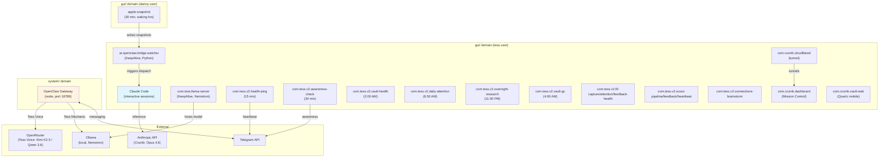
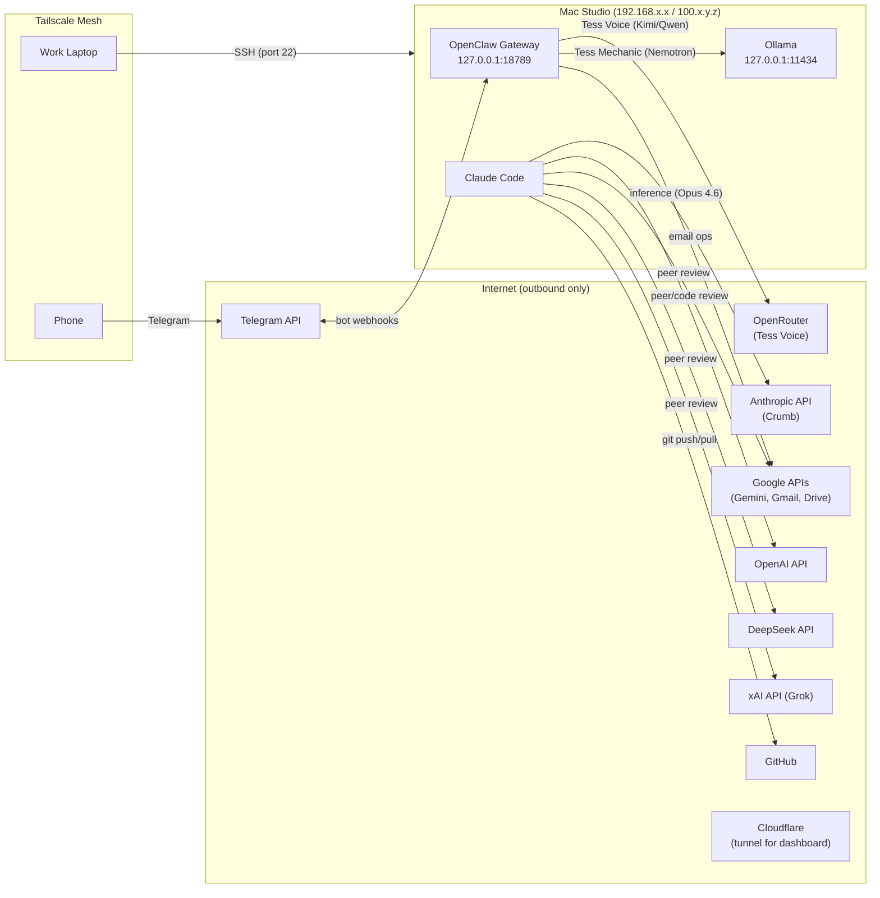

# 04 — Deployment

This section describes the physical hosting, process model, network topology, storage layout, credential management, and DNS configuration of the Crumb/Tess system.

**Source attribution:** Synthesized from the design spec ([[crumb-design-spec-v2-4]] §7, §9), [[crumb-deployment-runbook]], [[crumb-studio-migration]], [[openclaw-colocation-spec]], LaunchAgent/LaunchDaemon plists in `_openclaw/staging/`, and live system state.

---

## Host

Single physical host: **Mac Studio M3 Ultra** (96 GB RAM, 1 TB SSD, macOS 15+).

Three macOS user accounts:

| User | Role | Purpose |
|------|------|---------|
| `tess` | Operator primary | Owns the vault. Runs Crumb (Claude Code sessions). Hosts all LaunchAgents except Apple snapshot. |
| `openclaw` | Service account | Runs the OpenClaw gateway (LaunchDaemon). Dedicated user for Tess runtime isolation. |
| `danny` | Apple data owner | Personal macOS account. Runs the Apple snapshot LaunchAgent (Reminders, Calendar, Notes). Must be logged in (GUI or Fast User Switching background) for Apple integrations. |

**Remote access:** SSH via Tailscale mesh network. No public internet exposure. Client machines (work laptop, phone) connect through Tailscale's WireGuard tunnel using MagicDNS hostnames or direct Tailscale IPs (`100.x.y.z`).

**Terminal stack:** SSH → tmux (session persistence, `Ctrl+A` prefix, Catppuccin Mocha theme) → Claude Code (native installer, not npm).

---

## Process Model



**Service namespace note:** The system is in a migration state between two LaunchAgent namespaces. The legacy `ai.openclaw.*` namespace hosts bridge-watcher and remaining Tess operations; the new `com.tess.v2.*` namespace (tess-v2 project, Phase IMPLEMENT as of 2026-04-11) hosts the current authoritative set of 14 services plus support daemons. Both namespaces coexist during migration. Email triage services (both namespaces) were shut down on 2026-04-10 (TV2-036/037 cancelled).

### Prose Summary (for environments that cannot render Mermaid)

Three launchd domains host the system's processes:

**`gui/` domain (tess user):** Claude Code runs as interactive terminal sessions (on-demand, not persistent). The bridge-watcher (`ai.openclaw.bridge.watcher`) is a persistent Python process (KeepAlive) monitoring `_openclaw/inbox/` via kqueue for sub-ms file detection. `com.tess.llama-server` is a KeepAlive daemon hosting the local Nemotron model for Tess Mechanic and inference-heavy scheduled jobs. The tess-v2 project (Phase IMPLEMENT) registers 14 interval-scheduled `com.tess.v2.*` services — health-ping (15 min), awareness-check (30 min), vault-health (2:00 AM), vault-gc (pre-dawn), daily-attention (6:30 AM), overnight-research (11:00 PM), plus feed-intel capture/attention/feedback-health and scout-pipeline/feedback-health/weekly-heartbeat and connections-brainstorm. Crumb-side support runs as `com.crumb.*` LaunchAgents: `dashboard` (Mission Control server), `vault-web` (Quartz mobile site), `cloudflared` (tunnel to the dashboard), `vault-gc`, `qmd-index`, `system-stats`, `service-status`, and `telemetry-rollup`.

**`gui/` domain (danny user):** The apple-snapshot LaunchAgent writes Apple data (Reminders, Calendar, Notes) to `_openclaw/state/` every 30 minutes during waking hours. Requires danny's GUI session to be active.

**`system/` domain:** The OpenClaw gateway runs as a LaunchDaemon (`ai.openclaw.gateway`), bound to `127.0.0.1:18789`. This is the Tess runtime — manages Telegram bindings, model routing (Kimi K2.5 / Qwen 3.6 via OpenRouter for Tess Voice; Nemotron via local Ollama for Tess Mechanic), cron scheduling, and plugin dispatch.

**Migration state (2026-04-11):** The service layer is transitioning from the legacy `ai.openclaw.*` namespace to the new `com.tess.v2.*` namespace (tess-v2 project, 42/50 tasks complete). Bridge-watcher remains on the legacy namespace. Email triage (TV2-036/037) was cancelled and shut down 2026-04-10. TV2-043 Opportunity Scout is in re-soak; earliest gate pass Apr 13.

### Service Inventory

**Infrastructure (always-on):**

| Label | Type | User | Schedule | Purpose |
|-------|------|------|----------|---------|
| `ai.openclaw.gateway` | LaunchDaemon | openclaw | Always-on | OpenClaw gateway (Tess runtime) |
| `ai.openclaw.bridge.watcher` | LaunchAgent | tess | KeepAlive | kqueue watcher → bridge dispatch (Python) |
| `com.tess.llama-server` | LaunchAgent | tess | KeepAlive | Local Nemotron model host (Ollama) |
| `com.crumb.dashboard` | LaunchAgent | tess | KeepAlive | Mission Control HTTP server |
| `com.crumb.vault-web` | LaunchAgent | tess | KeepAlive | Quartz v4 static site for mobile vault access |
| `com.crumb.cloudflared` | LaunchAgent | tess | KeepAlive | Cloudflare tunnel → dashboard (remote access) |

**Tess-v2 operational services (`com.tess.v2.*` namespace, managed by `tess-v2/project-state.yaml`):**

| Label | Schedule | Purpose |
|-------|----------|---------|
| `com.tess.v2.health-ping` | Every 900s | Dead man's switch heartbeat |
| `com.tess.v2.awareness-check` | Every 1800s | Awareness check (Telegram) |
| `com.tess.v2.vault-health` | 2:00 AM daily | Nightly vault integrity check |
| `com.tess.v2.vault-gc` | Pre-dawn daily | Vault garbage collection |
| `com.tess.v2.backup-status` | Interval | Backup state monitoring |
| `com.tess.v2.daily-attention` | 6:30 AM daily | Daily attention planning |
| `com.tess.v2.overnight-research` | 11:00 PM daily | Scheduled research dispatch |
| `com.tess.v2.fif-capture` | Interval | Feed-intel capture |
| `com.tess.v2.fif-attention` | Interval | Feed-intel attention scan |
| `com.tess.v2.fif-feedback-health` | Interval | Feed-intel feedback health check |
| `com.tess.v2.scout-pipeline` | Interval | Opportunity Scout daily pipeline |
| `com.tess.v2.scout-feedback-health` | Interval | Scout feedback health |
| `com.tess.v2.scout-weekly-heartbeat` | Weekly | Scout weekly heartbeat |
| `com.tess.v2.connections-brainstorm` | Interval | Connections brainstorm dispatch |

**Apple and cross-user services:**

| Label | Type | User | Schedule | Purpose |
|-------|------|------|----------|---------|
| `com.crumb.apple-snapshot` | LaunchAgent | danny | Every 1800s (waking) | Apple data snapshots to `_openclaw/state/` |
| `com.crumb.drive-sync` | LaunchAgent | danny | 5:00 AM daily | Sync docs to Google Drive for NotebookLM |
| `com.crumb.system-stats`, `service-status`, `telemetry-rollup`, `qmd-index`, `vault-gc` | LaunchAgent | tess | Interval | Metrics, health, AKM index maintenance |

**Legacy `ai.openclaw.*` services:** `ai.openclaw.fif.capture/feedback/attention`, `health-ping`, `awareness-check`, `daily-attention`, `overnight-research`, `vault-health`. These are loaded but being migrated into `com.tess.v2.*` equivalents. The authoritative service set is managed via `Projects/tess-v2/project-state.yaml` `services:` field — cross-reference at deployment time.

**Project-registered services:** Projects with `repo_path` in `project-state.yaml` may list service labels in a `services` field. Session-end build verification restarts these services after code changes.

**Plist locations:** `_openclaw/staging/m1/` (milestone 1 services), `_openclaw/staging/m2/` (milestone 2), `_system/scripts/com.crumb.bridge-watcher.plist`. Deployed to `~/Library/LaunchAgents/` or `/Library/LaunchDaemons/` as appropriate.

**Project-registered services:** Projects with `repo_path` in `project-state.yaml` may list service labels in a `services` field. Session-end build verification restarts these services after code changes.

---

## Network Topology



### Prose Summary

The Mac Studio has no inbound ports open to the public internet. All remote access uses Tailscale's WireGuard mesh (encrypted, authenticated, NAT-traversing).

**Inbound traffic:**
- SSH (port 22) from Tailscale peers only
- Telegram bot webhooks to OpenClaw gateway (via Telegram's infrastructure, not direct)

**Internal services (loopback only):**
- OpenClaw gateway: `127.0.0.1:18789` (WebSocket)
- Ollama: `127.0.0.1:11434` (HTTP)

**Outbound traffic:**
- Anthropic API (Crumb inference — Opus 4.6)
- OpenRouter API (Tess Voice inference — Kimi K2.5 primary, Qwen 3.6 failover)
- OpenAI, Google, DeepSeek, xAI APIs (peer/code review panels)
- Telegram API (Tess messaging)
- Google APIs (Gmail, Calendar, Drive)
- GitHub (vault and project repo operations)
- Cloudflare (outbound tunnel for dashboard remote access)

**Health check endpoints:**
- Gateway liveness: `nc -z -w3 127.0.0.1 18789` or `curl -s -o /dev/null -w "%{http_code}" http://127.0.0.1:18789/`
- Note: `lsof -nP -iTCP:18789` gives false negatives without sudo for openclaw-owned sockets

---

## Storage Layout

### On-Host Storage

```
/Users/tess/
├── crumb-vault/                    # THE VAULT — Obsidian + git-tracked
│   ├── Projects/                   # Active project scaffolds
│   ├── Archived/Projects/          # Archived projects
│   ├── Domains/                    # 8 life domain directories
│   ├── Sources/                    # Knowledge notes (books, articles, signals)
│   ├── _system/                    # Infrastructure (docs, scripts, logs, reviews)
│   ├── _inbox/                     # Manual file drop zone
│   ├── _attachments/               # Unaffiliated binary storage
│   ├── _openclaw/                  # Tess workspace + bridge transport
│   ├── .claude/                    # Skills, agents, settings
│   ├── .git/                       # Version history (markdown only)
│   ├── CLAUDE.md                   # Governance surface
│   └── AGENTS.md                   # Tool-agnostic context
├── crumb-vault-mirror/             # GitHub mirror (read-only, for claude.ai)
└── .config/crumb/.env              # API keys (mode 600)

/Users/openclaw/
├── .openclaw/
│   ├── openclaw.json               # Gateway configuration
│   └── workspace/                  # Agent workspace
└── .local/bin/openclaw             # Gateway binary

/Users/danny/
└── (standard macOS home — Apple apps data source)
```

### Git Tracking Strategy

The vault is git-tracked for markdown version history. Binary files are excluded:

```gitignore
# Binary attachments — tracked via companion notes
*.pdf  *.docx  *.pptx  *.xlsx
*.png  *.jpg  *.jpeg  *.gif  *.webp  *.svg
```

Companion notes (markdown) ARE tracked — they carry the metadata, description, and references for each binary. The binary itself doesn't benefit from diff-based history.

**Binary durability:** Git does not protect binaries. A separate sync/backup mechanism (Time Machine, iCloud, Obsidian Sync) is required for binary survival.

### Backup

| Mechanism | Scope | Frequency | Location |
|-----------|-------|-----------|----------|
| Git push | Vault markdown | Session-end (conditional) | GitHub (private repo) |
| GitHub mirror sync | Vault markdown | Automated (`mirror-sync.sh`) | `crumb-vault-mirror/` → GitHub (public-safe subset) |
| Time Machine | Full disk | Continuous | External/network drive |
| Vault backup script | Vault state snapshot | Cron (`vault-backup.sh`) | Cloud storage |

---

## Credential Management

### Credential Map

| Credential | Storage | User | Consumer | Rotation |
|-----------|---------|------|----------|----------|
| Anthropic API key | macOS Keychain | tess | Claude Code (Crumb) | Manual |
| OpenAI API key | `~/.config/crumb/.env` | tess | peer-review, code-review skills | Manual |
| Google/Gemini API key | `~/.config/crumb/.env` | tess | peer-review skill | Manual |
| DeepSeek API key | `~/.config/crumb/.env` | tess | peer-review skill | Manual |
| xAI/Grok API key | `~/.config/crumb/.env` | tess | peer-review skill | Manual |
| OpenRouter API key | `~/.config/crumb/.env` | tess, openclaw | Tess Voice cloud inference | Manual |
| GitHub PAT | macOS Keychain (credential-osxkeychain) | tess | Git push/pull | Auto-cached |
| OpenClaw token | `/Users/openclaw/.openclaw/openclaw.json` | openclaw | Gateway auth | Per config |
| Telegram bot tokens | LaunchAgent plist env vars | tess | awareness-check, health-ping, scout services | Manual |
| Cloudflare tunnel token | macOS Keychain | tess | cloudflared tunnel (dashboard remote access) | Manual |
| X (Twitter) OAuth | Dynamic (Keychain refresh) | tess | feed-intel framework | Auto-refresh |

### Security Model

**Tier 1 (mandatory, OS-level):**
- Dedicated `openclaw` macOS user — filesystem isolation. Crumb credentials are inaccessible to OpenClaw processes.
- `~/.config/crumb/.env` owned by tess, mode 600 (no group/other read).
- Vault ownership: `tess:crumbvault` group. `openclaw` is a group member with read access. Write restricted to `_openclaw/` via group permissions.

**Tier 1 (mandatory, application-level):**
- `workspaceOnly` in `openclaw.json` restricts LLM file tool access to the OpenClaw workspace. Vault reads go through the app layer, not raw file tools.
- Review safety denylist (`_system/docs/review-safety-denylist.md`) prevents sensitive content in peer/code review dispatches to external APIs.

**Known constraints:**
- `sudo -u <user>` does NOT carry TCC grants. Apple integration snapshots require a LaunchAgent in danny's GUI domain, not cross-user sudo.
- Keychain may prompt for API keys during first SSH session — resolve interactively before automating.
- X OAuth tokens rotate — static env files can't hold them. Dynamic store (Keychain refresh) required.
- `com.apple.provenance` xattr causes `launchctl bootstrap` failures on macOS 15+. Must strip as the absolute last operation before bootstrap.

---

## DNS

The system does not run its own DNS server. DNS resolution uses standard system defaults plus Tailscale MagicDNS.

| Service | Resolution | Notes |
|---------|-----------|-------|
| Tailscale MagicDNS | `<hostname>.tailXXXXXX.ts.net` | Auto-generated from device name. Used for SSH access. |
| Studio direct | Tailscale IP `100.x.y.z` | Alternative to MagicDNS hostname |
| External APIs | Public DNS | Standard system resolver for all outbound API traffic |
| OpenClaw gateway | `127.0.0.1:18789` | Loopback only — no DNS entry needed |

**SSH config (client side):** Host entries in `~/.ssh/config` use either MagicDNS hostnames or direct Tailscale IPs.

---

## Deployment Procedures

Two deployment runbooks exist for different scenarios:

| Runbook | Path | Scope | Time |
|---------|------|-------|------|
| Crumb Deployment | `_system/docs/operator/how-to/crumb-deployment-runbook.md` | Fresh Crumb install on macOS. 8 phases: deps → Claude Code → Git → vault → shell → client → verify → enhancements | ~45 min (fresh), ~15 min (migration) |
| Studio Migration | `_system/docs/crumb-studio-migration.md` | Full system migration including OpenClaw. 14 phases: system → brew → Python → Claude Code → Git → PAT → vault → config → OpenClaw user → permissions → Docker → services | ~2 hours |

**OpenClaw colocation spec:** Full security architecture at `_system/docs/openclaw-colocation-spec.md` (67 KB). Covers the two-layer security model, vault access model, threat model (18 threats + mitigations), and hardening tiers.

---

## Platform-Specific Constraints

macOS-specific behaviors that affect deployment and operations:

| Constraint | Impact | Mitigation |
|-----------|--------|------------|
| TCC grants scoped to bootstrap domain | `sudo -u` doesn't carry TCC. Apple data inaccessible via cross-user process. | LaunchAgent in owning user's GUI domain + snapshot files. |
| Danny must be logged in | Apple integrations fail without GUI session. iCloud stops, AppleScript can't reach apps. | Fast User Switching keeps danny's session alive in background. |
| `com.apple.provenance` xattr | Breaks `launchctl bootstrap` on macOS 15+. Re-attaches on every file edit. | Strip as absolute last step before bootstrap. |
| `date +%H` octal bug | Zero-padded hours cause bash arithmetic errors. | Use `date +%-H` (unpadded). |
| openrsync vs GNU rsync | `--delete-excluded` deletes ALL excluded files including `.git/`. | Use `--delete` + post-sync cleanup. Never `--delete-excluded`. |
| `launchctl list` omits exited jobs | Calendar-interval jobs with exit 0 not shown. | Use `launchctl print gui/$(id -u)/<label>`. |
| npm `--prefix` installs | CLI lands in `.local/bin/` but node binary doesn't. | Reference `/opt/homebrew/bin/node` explicitly in plist ProgramArguments. |
