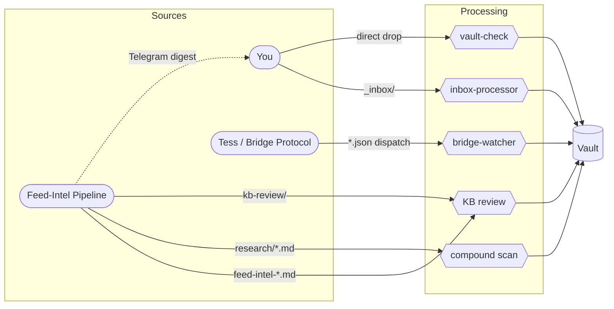
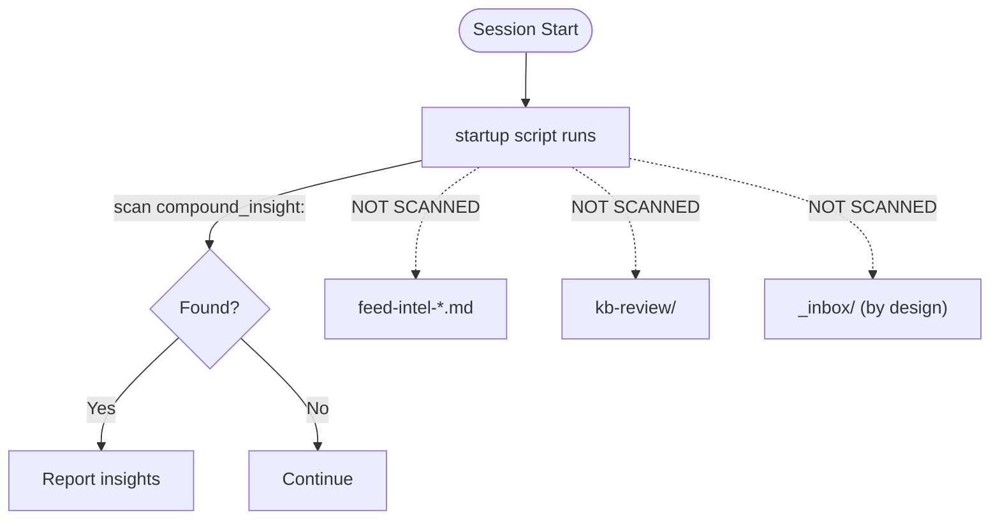

# Vault Intake Map

How things get into the vault, what processes them, and what requires a Claude Code session.

Last validated: 2026-02-27

---

## The Short Version

| Path | Drop Location | Detected By | Requires CC Session? | Who Processes |
|------|--------------|-------------|---------------------|---------------|
| General inbox | `_inbox/` | Manual ("process inbox") | Yes | Crumb (inbox-processor skill) |
| Feed-intel routed items | `_openclaw/inbox/feed-intel-*.md` | **Not auto-detected** | Yes | Crumb (manual) |
| Research dispatch output | `_openclaw/feeds/research/*.md` | Session startup (auto, compound scan) | Yes | Crumb (startup skill routes insights) |
| Feed-intel `save` command | `_openclaw/feeds/kb-review/` | **Not auto-detected** | Yes | Crumb (KB review) |
| Feed-intel daily digest | Telegram | You read it | No | You (feedback commands via Telegram) |
| NLM export | `_inbox/` (with sentinel) | Manual ("process inbox") | Yes | Crumb (inbox-processor, NLM path) |
| Direct KB drop | `Sources/`, `Domains/` | vault-check on commit | No | Nobody — it's already home |
| Bridge dispatch (write ops) | `_openclaw/inbox/*.json` | bridge-watcher (launchd) | Spawns its own | Crumb (via `claude --print`) |

---

## Path-by-Path Detail

### 1. General Inbox (`_inbox/`)

**What it's for:** Anything you want to get into the vault but don't want to manually format — markdown files, PDFs, images, Word docs, spreadsheets.

**How things get there:** You drop files in manually (Finder, CLI, whatever).

**How it gets processed:** The inbox-processor skill handles everything — classification, frontmatter generation, companion notes for binaries, routing to the correct vault location. It handles four content types: standard markdown, NLM exports (detected via sentinel markers), text-extractable binaries (PDF/DOCX/PPTX/XLSX with `markitdown` extraction), and images (EXIF metadata, companion notes).

**Detection:** Not auto-detected at session startup. You invoke it: "process inbox", "check inbox", or "I dropped some files in."

**Requires Claude Code session:** Yes.

---

### 2. Feed-Intel Routed Items (`_openclaw/inbox/feed-intel-*.md`)

**What it's for:** High-signal items from the x-feed-intel pipeline that passed the triage routing bar (tagged `crumb-architecture`, confidence ≥ medium).

**How things get there:** The pipeline's vault router writes them automatically during the daily attention clock. Each file contains triage metadata in frontmatter, the triage output block, a content excerpt, and a source link.

**Detection:** **Gap — not auto-detected at session startup.** Feed-intel files sit there until you explicitly ask Crumb to look, or until you notice them in Obsidian.

**Processing:** Crumb evaluates spec-relevance, routes to vault location or dismisses, assigns `#kb/` tags from canonical taxonomy.

**Idempotency:** Filename `feed-intel-{canonical_id}.md` is the dedup key. Re-triage updates above the `<!-- OPERATOR NOTES BELOW -->` marker without touching your annotations.

**Requires Claude Code session:** Yes.

---

### 3. Research Dispatch Output (`_openclaw/feeds/research/*.md`)

**What it's for:** Deep research triggered by the `research` feedback command (from digest replies or `research {url}` standalone command). These are enriched research notes with thread expansion, reply mining, linked content fetch, and compound insight metadata.

**How things get there:** Feed-intel's research dispatch → bridge dispatch → `claude --print` session → research output written to `_openclaw/feeds/research/`.

**Detection:** Auto-detected at session startup. The startup script scans for files with `compound_insight:` in their YAML frontmatter that haven't been routed or dismissed yet. Reports count and file paths.

**Processing:** The startup skill presents each compound insight (pattern, scope, target, confidence, durability) and prompts for: route / defer / dismiss. Routing creates the target artifact (ADR, pattern doc, convention update, etc.) and marks the research file as routed. Stale perishable insights (>90 days) are flagged separately with three options: revalidate / dismiss / promote to permanent.

**Requires Claude Code session:** Yes.

---

### 4. Feed-Intel `save` Command (`_openclaw/feeds/kb-review/`)

**What it's for:** Items you manually promote from the daily digest via the `save` Telegram command. These are items you've already eyeballed and decided are worth keeping.

**How things get there:** Reply `{ID} save` to a digest item in Telegram. The pipeline stages the item to `_openclaw/feeds/kb-review/`.

**Detection:** **Not auto-detected at session startup.** No scan exists for this directory in the startup script.

**Processing:** Crumb reviews during sessions — assigns `#kb/` tags, routes to `Sources/` or appropriate vault location.

**Requires Claude Code session:** Yes.

---

### 5. Feed-Intel Daily Digest (Telegram)

**What it's for:** The full daily triage output — all items, grouped by priority tier, delivered to Telegram. This is your primary review surface for everything the pipeline captured.

**How things get there:** The attention clock formats all triaged items and sends via Telegram bot.

**Detection:** You read it.

**Processing:** You interact via six feedback commands: promote, save, ignore, add-topic, expand, research. These trigger pipeline actions (vault routing, KB staging, topic config changes, thread expansion, research dispatch). No Claude Code session needed for the feedback loop itself.

**Requires Claude Code session:** No (but some downstream effects do — research output, saved items).

---

### 6. NotebookLM Exports (`_inbox/` with sentinel)

**What it's for:** AI-generated book digests, chapter digests, fiction digests, and source digests from NotebookLM, processed into properly-indexed knowledge notes.

**How things get there:** Export from NotebookLM (via Chrome extension or copy-paste), drop the `.md` file into `_inbox/`. The file must contain a sentinel marker (`crumb:nlm-export v=1 template=...`) or match a known heading pattern for template inference.

**Detection:** Same as general inbox — not auto-detected. Invoke "process inbox."

**Processing:** The inbox-processor's NLM path: sentinel detection → metadata extraction → source_id generation with collision check → dedup against existing `Sources/` notes → quality gate (podcast/video get `needs_review` tag) → frontmatter generation (`type: knowledge-note`, `schema_version: 1`) → route to `Sources/{type}/`. Templates available: `book-digest-v2`, `source-digest-v2`, `chapter-digest-v1`, `fiction-digest-v1`.

**Requires Claude Code session:** Yes.

---

### 7. Direct KB Drop (`Sources/`, `Domains/`, etc.)

**What it's for:** Pre-formatted content that's already vault-ready. If the frontmatter is correct and the file is in the right place, nothing needs to process it.

**How things get there:** You create the file directly in the target location — manually, via script, or via any tool that can write to the vault filesystem.

**Detection:** vault-check validates on next commit (pre-commit hook). Checks frontmatter fields, tag format, naming conventions.

**Processing:** None required. The file is already in its final location. vault-check will catch schema violations, missing required fields, or naming issues.

**The catch:** You need to get the frontmatter right. For knowledge notes, that means: `type: knowledge-note`, `schema_version: 1`, `source:` block with all subfields, at least one `#kb/` tag, proper `note_type` and `scope`. For other vault content: correct `type`, `domain`, `status`, `created`/`updated` dates, appropriate tags. The inbox-processor exists specifically to handle this complexity for you.

**Requires Claude Code session:** No.

---

### 8. Bridge Dispatch — Write Operations (`_openclaw/inbox/*.json`)

**What it's for:** Long-running tasks that Tess dispatches to Crumb via the bridge protocol — `start-task`, `invoke-skill`, `quick-fix`. These are multi-stage operations with lifecycle management, budget enforcement, and escalation.

**How things get there:** Tess writes `.json` request files to `_openclaw/inbox/` following the dispatch protocol schema.

**Detection:** The bridge-watcher (`bridge-watcher.py`, registered as launchd service) monitors `_openclaw/inbox/` for new `.json` files and dispatches them.

**Processing:** The watcher spawns isolated `claude --print` sessions. Each stage is bounded, governance-verified, and budget-tracked. The dispatch protocol manages the full lifecycle: queued → running → stage-complete → complete/failed/canceled.

**Requires Claude Code session:** Spawns its own (headless `claude --print`). No interactive session needed.

---

## Planned / Future Paths

### Manual Intake Adapter (FIF, deferred)

Tess as universal capture surface for ad-hoc URLs from any device. Paste a URL to Tess on Telegram → framework adapter normalizes, applies lightweight/skipped triage (operator-curated = high relevance), routes via standard vault router. Designed as a feed-intel-framework source adapter, not a standalone system. Activates after M2 (X migration) + one non-X adapter proves the contract.

Future convenience wrappers: iOS Shortcuts / share sheet → Telegram, browser bookmarklet.

### Web Presentation Layer (FIF M-Web, planned)

Private web app replacing Telegram as primary digest surface. Express API + React SPA on Mac Studio, external access via Cloudflare Tunnel + Access (email OTP). Would give you a browser-native review surface with richer interaction than Telegram reply commands.

---

## Detection Gaps

Three intake paths have no auto-detection at session startup (one by design):

1. **`feed-intel-*.md` in `_openclaw/inbox/`** — not scanned by the startup script. Adding a `feed-intel-*.md` glob to `session-startup.sh` would surface these automatically.

2. **`_openclaw/feeds/kb-review/`** — saved items from the `save` command. Adding a directory scan here would surface pending KB reviews at session start.

3. **`_inbox/`** — the general inbox is never auto-scanned. This is by design (the inbox-processor is a judgment-heavy skill, not a mechanical scan), but it means files can sit there indefinitely if you forget.

These are low-effort additions to the startup script if you want them surfaced automatically.

---

## Process Diagrams

### Intake Processing Overview

How items flow from source through processing to vault. Edge labels show drop locations.

Note: The Telegram digest path is dotted because it doesn't require a CC session — you interact via feedback commands directly. Downstream effects (research, save) re-enter the system through the feed-intel paths above.

### Startup Detection Flow

What the session startup script auto-detects vs what falls through.

Dotted arrows indicate detection gaps — items in these locations sit unnoticed until manually checked.
