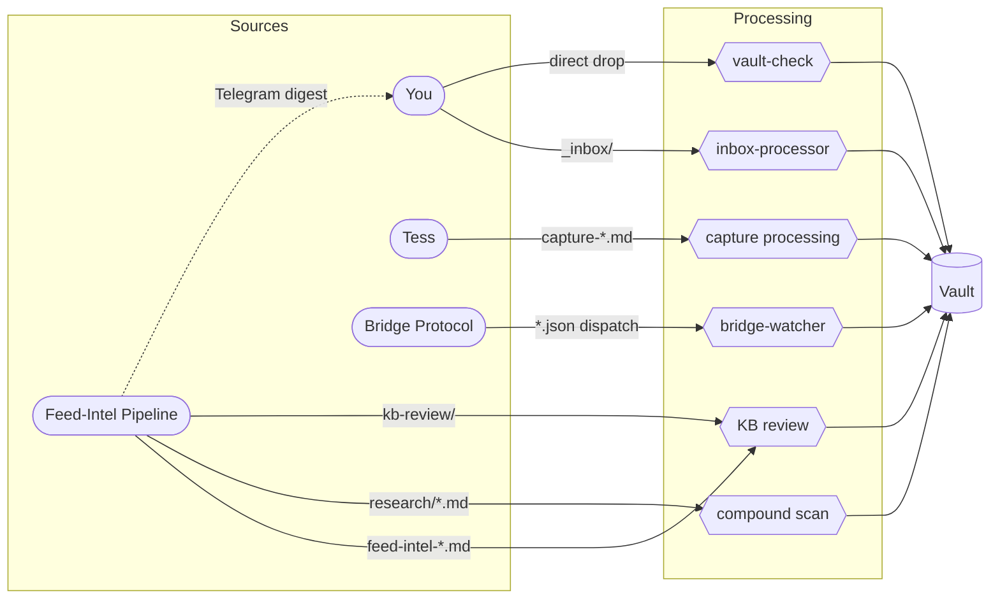

# Vault Intake Processing Overview

How items flow from source through processing to vault. Edge labels show drop locations.

See [[vault-intake-map]] for full path-by-path detail.

Dotted line: Telegram digest doesn't require a CC session — you interact via feedback commands directly. Downstream effects (research, save) re-enter the system through the feed-intel paths above.
