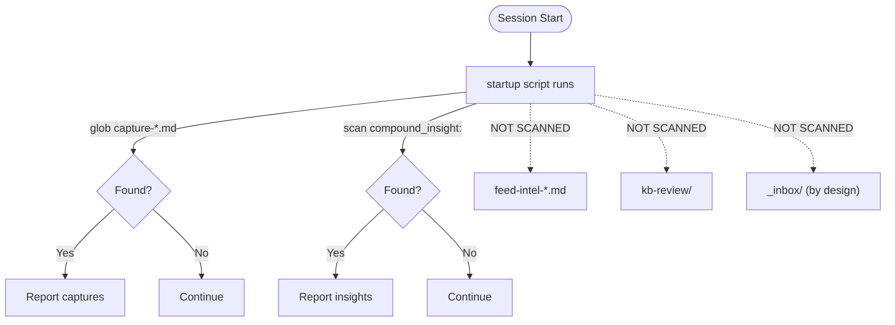

# Startup Detection Flow

What the session startup script auto-detects vs what falls through.

See [[vault-intake-map]] for full path-by-path detail.

Dotted arrows indicate detection gaps — items in these locations sit unnoticed until manually checked.
